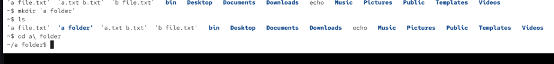
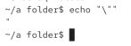
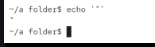
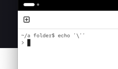
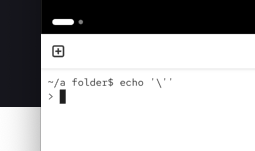

we autocomplete a filename that contains a whitespace character. bash might autocomplete it to:

`cat a\ file.txt`

\ will disable normal behaviour

excaping would also allow us to print a single double quote in the following way:

you coudl also do `'"'`

doesnt work with single quotes..:

signle quotes disable ALL rewrites/expansions -> so even backlash is disabled, here it means that last single quote and then there is no termination of command ..:

