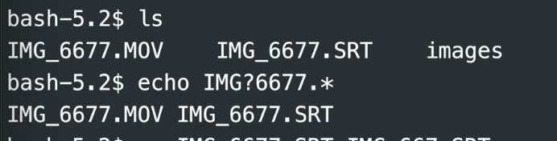
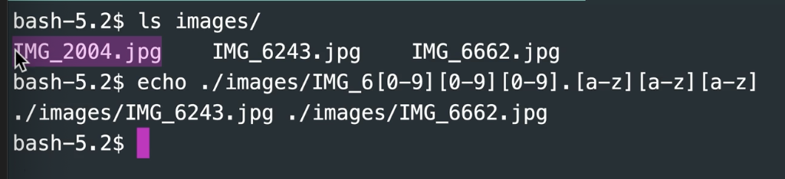
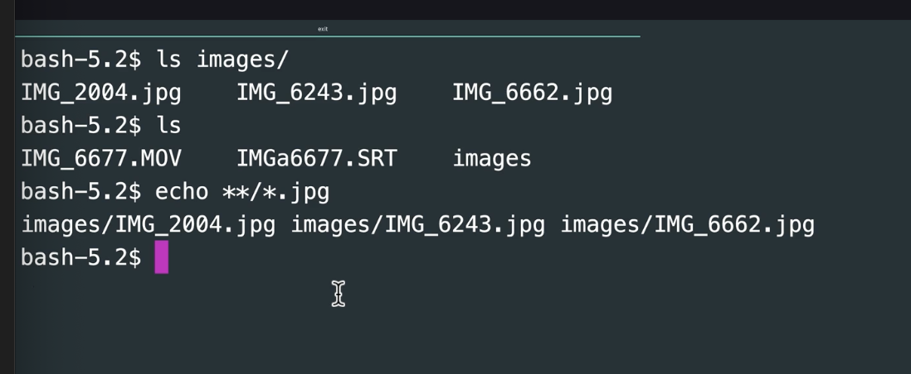
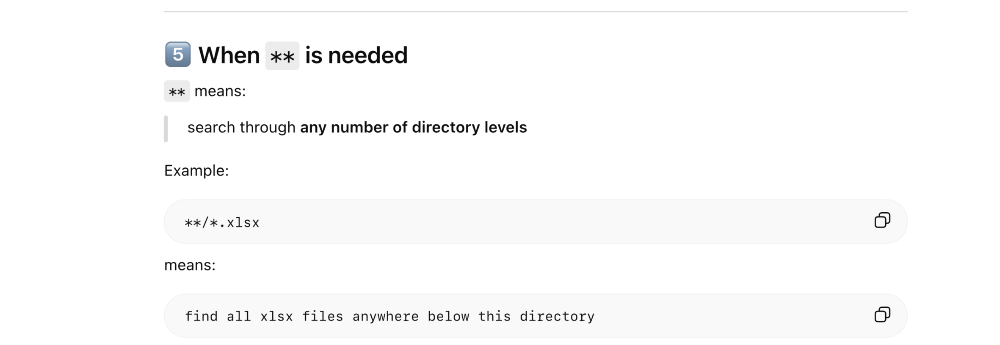
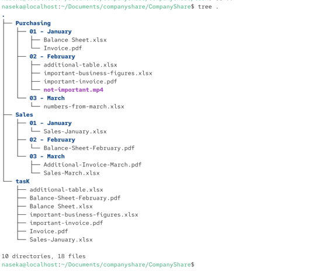
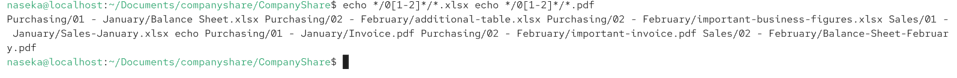
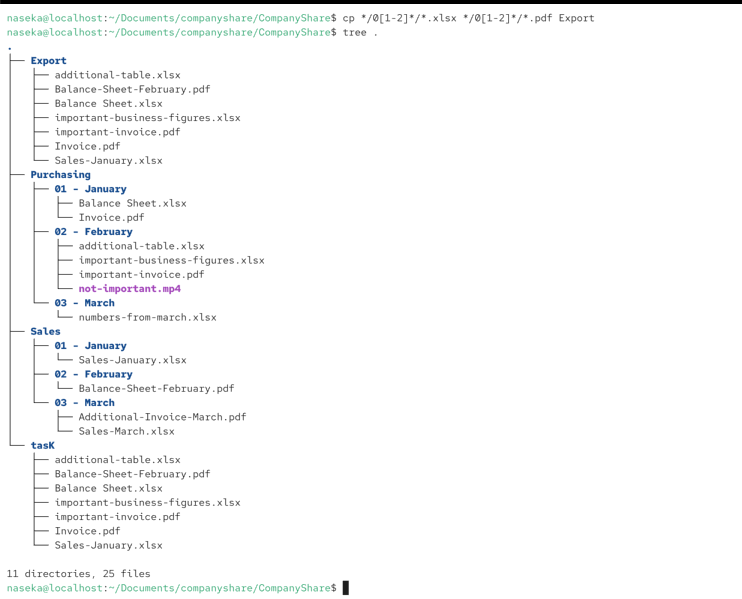
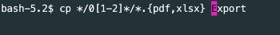
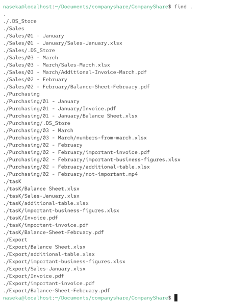
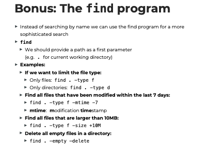

# touch

creat file / files
change timestamp

# mkdir
create a folder

# mv
move

```bash
mv andy.txt /ready
```
rename an existing file

`mv firstname.txt newname.txt`

# cp

copy

## cp -R

copies a whole folder

# rm 
remove file or files permanently (no bin)

## rm -r
delete empty or non empty directory

# rmdir
delete an empty directory


```bash
                                                                  /.-~
naseka@localhost:~$ ls
Desktop  Documents  Downloads  Music  Pictures  Public  Templates  Videos
naseka@localhost:~$ cd Desktop
naseka@localhost:~/Desktop$ mkdir tmp_website
naseka@localhost:~/Desktop$ cd tmp_website
naseka@localhost:~/Desktop/tmp_website$ touch index.html style.css script.js
naseka@localhost:~/Desktop/tmp_website$ mkdir style.css
mkdir: cannot create directory ‘style.css’: File exists
naseka@localhost:~/Desktop/tmp_website$ mkdir styles
naseka@localhost:~/Desktop/tmp_website$ mv style.css styles
naseka@localhost:~/Desktop/tmp_website$ ls
index.html  script.js  styles
naseka@localhost:~/Desktop/tmp_website$ cd styles
naseka@localhost:~/Desktop/tmp_website/styles$ ls
style.css
naseka@localhost:~/Desktop/tmp_website/styles$ cd ..
naseka@localhost:~/Desktop/tmp_website$ mkdir scripts
naseka@localhost:~/Desktop/tmp_website$ ls
index.html  script.js  scripts  styles
naseka@localhost:~/Desktop/tmp_website$ mv style.css /styles
mv: cannot stat 'style.css': No such file or directory
naseka@localhost:~/Desktop/tmp_website$ \ls
index.html  script.js  scripts	styles
naseka@localhost:~/Desktop/tmp_website$ ls
index.html  script.js  scripts  styles
naseka@localhost:~/Desktop/tmp_website$ mv script.js index.js
naseka@localhost:~/Desktop/tmp_website$ ls
index.html  index.js  scripts  styles
naseka@localhost:~/Desktop/tmp_website$ mv index.js script.js
naseka@localhost:~/Desktop/tmp_website$ ls
index.html  script.js  scripts  styles
naseka@localhost:~/Desktop/tmp_website$ mv script.js /scripts/index.js
mv: cannot move 'script.js' to '/scripts/index.js': No such file or directory
naseka@localhost:~/Desktop/tmp_website$ mv script.js scripts/index.js
naseka@localhost:~/Desktop/tmp_website$ ls
index.html  scripts  styles
naseka@localhost:~/Desktop/tmp_website$ cd scripts
naseka@localhost:~/Desktop/tmp_website/scripts$ ls
index.js
naseka@localhost:~/Desktop/tmp_website/scripts$ cd ..
naseka@localhost:~/Desktop/tmp_website$ ls
index.html  scripts  styles
naseka@localhost:~/Desktop/tmp_website$ mkdir pages
naseka@localhost:~/Desktop/tmp_website$ ls
index.html  pages  scripts  styles
naseka@localhost:~/Desktop/tmp_website$ touch pages/page1.html
naseka@localhost:~/Desktop/tmp_website$ ls
index.html  pages  scripts  styles
naseka@localhost:~/Desktop/tmp_website$ cd pages
naseka@localhost:~/Desktop/tmp_website/pages$ cp page1.html page2.html
naseka@localhost:~/Desktop/tmp_website/pages$ ls
page1.html  page2.html
naseka@localhost:~/Desktop/tmp_website/pages$ cp page1.html page3.html
naseka@localhost:~/Desktop/tmp_website/pages$ ls
page1.html  page2.html  page3.html
naseka@localhost:~/Desktop/tmp_website/pages$ mv page2.html ..
naseka@localhost:~/Desktop/tmp_website/pages$ ls
page1.html  page3.html
naseka@localhost:~/Desktop/tmp_website/pages$ cd 
naseka@localhost:~$ cd ..
naseka@localhost:/home$ ls
janniswork  naseka
naseka@localhost:/home$ cd naseka
naseka@localhost:~$ ls
Desktop  Documents  Downloads  Music  Pictures  Public  Templates  Videos
naseka@localhost:~$ cd Desktop
naseka@localhost:~/Desktop$ ls
tmp_website
naseka@localhost:~/Desktop$ cd tmp_website
naseka@localhost:~/Desktop/tmp_website$ ls
index.html  page2.html  pages  scripts  styles
naseka@localhost:~/Desktop/tmp_website$ rm index.html pages/page1.html pages/page3.html
naseka@localhost:~/Desktop/tmp_website$ ls
page2.html  pages  scripts  styles
naseka@localhost:~/Desktop/tmp_website$ mv page2.html index.html
naseka@localhost:~/Desktop/tmp_website$ ls
index.html  pages  scripts  styles
naseka@localhost:~/Desktop/tmp_website$ rmdir pages
naseka@localhost:~/Desktop/tmp_website$ ls
index.html  scripts  styles
naseka@localhost:~/Desktop/tmp_website$ rm -r ..
rm: refusing to remove '.' or '..' directory: skipping '..'
naseka@localhost:~/Desktop/tmp_website$ cd ..
naseka@localhost:~/Desktop$ rm -r tmp_website
naseka@localhost:~/Desktop$ ls
naseka@localhost:~/Desktop$ 

```


# Globbing = filename expansion

## *
0 to any number of characters

```bash
mv *.jpg images # all files ending with .jpg are moved to fodler images
mv * images # all files moved to images
```
## quotes

single quotes can make globing not applied

```bash
touch '*.JPG' # thats how we disabled globbibng and we create a file with actual name *.JPG
```

## ?
matches any single character



## '[0-9]'
sqauare brackets allow to specify a character from a character range (here: all numbers)



## **
matches zero up to arbitrarily many characters (including /, so it looks into subfolders)
might be necessary to enable this:

### shopt -s globstar






## danger: bash doesnt differentate between a file name and parameter

        If we then execute rm * in that folder:
        ► 1.: The * will be expanded, so -rf will appear in the command
        ► 2.: rm will think that -rf is a parameter
        ► -r means: recursive
        ► -f means: don't ask

### problem: 
```bash
rm *
```
shell to rozbali na

```bash
rm file1 file2 -rf # here rm si mysli, ze -rf je parameter
```

### to not have a problem:

```bash
rm ./*
```
shell to rozbali na:

```bash
rm ./file1 ./file2 ./-rf # tady -rf je file, ne parameter
```


# wget: to download files to vm directly

 GNU Wget is a free utility for non-interactive download of files from the Web.  It supports HTTP, HTTPS, and FTP protocols, as well as retrieval
       through HTTP proxies.

```bash
naseka@localhost:~/Desktop$ sudo dnf install wget
[sudo] password for naseka: 
Last metadata expiration check: 1:08:42 ago on Thu 29 Jan 2026 08:01:05 PM CET.
Package wget-1.24.5-5.el10.aarch64 is already installed.
Dependencies resolved.
Nothing to do.
Complete!
naseka@localhost:~/Desktop$ wget https://downloads.codingcoursestv.eu/055%20-%20bash/globbing/companyshare.zip
--2026-01-29 21:10:59--  https://downloads.codingcoursestv.eu/055%20-%20bash/globbing/companyshare.zip
Resolving downloads.codingcoursestv.eu (downloads.codingcoursestv.eu)... 78.46.3.25
Connecting to downloads.codingcoursestv.eu (downloads.codingcoursestv.eu)|78.46.3.25|:443... connected.
HTTP request sent, awaiting response... 200 OK
Length: 15052 (15K) [application/zip]
Saving to: ‘companyshare.zip’

companyshare.zip                        100%[============================================================================>]  14.70K  --.-KB/s    in 0.02s   

2026-01-29 21:10:59 (601 KB/s) - ‘companyshare.zip’ saved [15052/15052]

naseka@localhost:~/Desktop$ 
```


# tree .



## to see in a structured way what we want to copy - use echo before copying:



answer to the task:



# expansion: pdf or xlsx



# FIND program
instead of globbing 

## find .

here i can see all files/folders in the current directory



## we can filter:

```bash
find . -type f # find all files in current workding directory of type file
find . -type d # find all files in current workding directory of type dorectory
```

man 