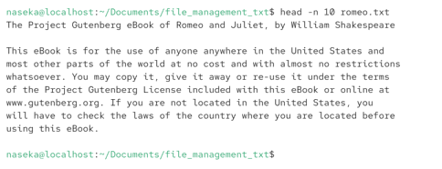
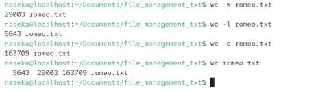
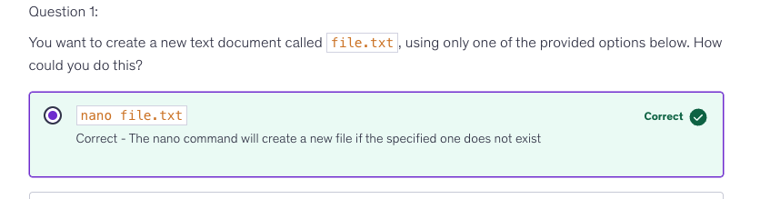

# cat filename

output the content of file to the terminal

## catting binary data (for ex. cat image file)
it can change our terminal behaviour.

after that we might need to restart the terminal

## you can use globbing for file name

## sometimes cat doesnt let me to see the whole book

file is too long and it doesnt fit into the bugger.

# head
shows us the start of a text file (10 lines by defialt)

## -n 
to output first sspecified amount of lines

# tail
end of text file

# less
allows to read large files
## i can scroll there (use arrows)
## F key 
-> to jump page ahead
## B 
-> page back
## = 
show current position

## /
forward search

## ? 
backward search

# get the size of the file

## wc = word count
`wc file.txt`

-l counts numnber of lines
-w number of words
-c number of bytes

`wc -l file.txt`

## du 
disk usage: will calculate the size of all items in the folder

units are displayed.

-s: to get a summary
-h: human readable

# text editors for bash

## pico / nano
simple text editor

## vi / vim

## create file with text editor

