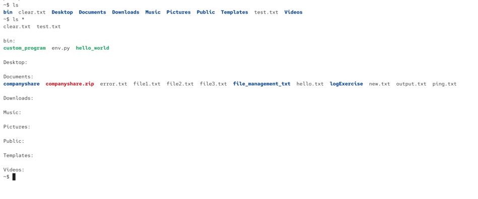
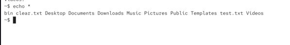
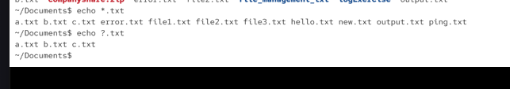
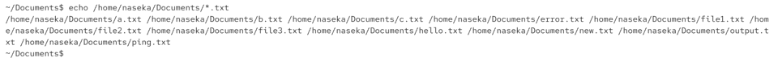

shell expansion = before executing our shell it rewrites our command and parses the command. it happens before command is executed

file name expension: `ls *` -> asterisk sign gets expanded, meaning bash gets the contents of the current directory 

here we can see contents of insides of folders (foe x. Documents):

`echo *`: show contents of my current directory:

we can also filter with `*` or `?`

