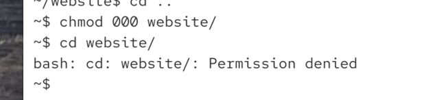
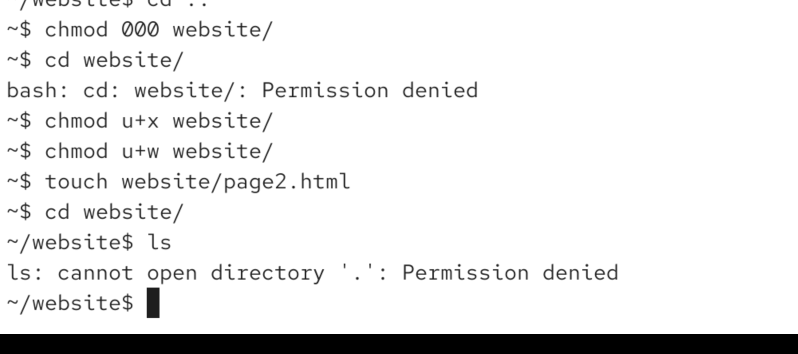
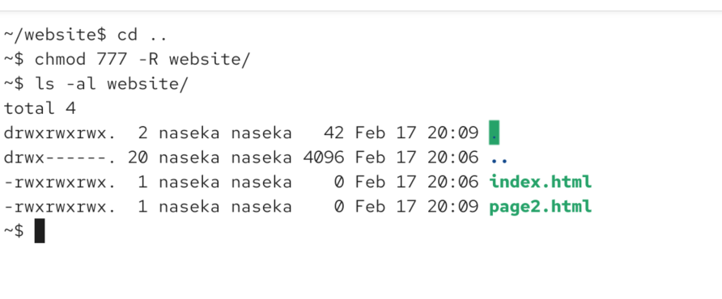

permissions
r access directrory contents

w add or remove files

x enter and traverse directory



chmod in practice:



to change permissions for whole directory structure (all files insdie will have permissions changed) -R



. means current directory
.. means one step back (will be home directory)
. has a greenbackground to warn you that everyone has the full rights for this directory

means naseka group still owns the home folder
lauren group is the owner of the rest

```bash
~$ sudo chown naseka:lauren -R website/
[sudo] password for naseka: 
~$ ls -al website/
total 4
drwxrwxrwx.  2 naseka lauren   42 Feb 17 20:09 .
drwx------. 20 naseka naseka 4096 Feb 17 20:06 ..
-rwxrwxrwx.  1 naseka lauren    0 Feb 17 20:06 index.html
-rwxrwxrwx.  1 naseka lauren    0 Feb 17 20:09 page2.html
~$ 
```

