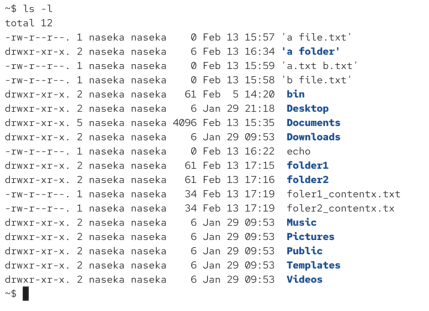

# What is a file?

file - container for storing, accessing and / or managing data

has unique identifier or name. name combined with path = unique location

file has attributes: size, permissions, ownership, timestamps etc

# How is the data stored?

file.txt (referencing inode)

->

inode (referencing actual data on disk): stores metadata (file type, access rihts, number of hardlinks, file sie, last modified date, last access date, where the sdata physically stored?)

-> 

Data on Disk


# How does folder work?

folder 

->

inode: stores metadata


-> 

file.txt


# Files on Unix

everything (almost) is considered a file. for ex. physical drive is a file and it will be represented as a file. 

different kinds of files:

* ordinary files (-)
* directories (d)
* symbolic links (l)
* character device (c)
* block device (b)
* named pipes (p)
* sockets (s)

we can show the type of a file with the ls command: `ls -l [folder / file]` -> the type then shows up as the firstr character of the first column



first letter (in my case dash it will be ordinary file):

```bash
~$ ls
'a file.txt'  'a.txt b.txt'   bin       Documents   echo      folder2               foler2_contentx.tx   Pictures   Templates
'a folder'    'b file.txt'    Desktop   Downloads   folder1   foler1_contentx.txt   Music                Public     Videos
~$ ls -l
total 12
-rw-r--r--. 1 naseka naseka    0 Feb 13 15:57 'a file.txt'
drwxr-xr-x. 2 naseka naseka    6 Feb 13 16:34 'a folder'
-rw-r--r--. 1 naseka naseka    0 Feb 13 15:59 'a.txt b.txt'
-rw-r--r--. 1 naseka naseka    0 Feb 13 15:58 'b file.txt'
drwxr-xr-x. 2 naseka naseka   61 Feb  5 14:20  bin
drwxr-xr-x. 2 naseka naseka    6 Jan 29 21:18  Desktop
drwxr-xr-x. 5 naseka naseka 4096 Feb 13 15:35  Documents
drwxr-xr-x. 2 naseka naseka    6 Jan 29 09:53  Downloads
-rw-r--r--. 1 naseka naseka    0 Feb 13 16:22  echo
drwxr-xr-x. 2 naseka naseka   61 Feb 13 17:15  folder1
drwxr-xr-x. 2 naseka naseka   61 Feb 13 17:16  folder2
-rw-r--r--. 1 naseka naseka   34 Feb 13 17:19  foler1_contentx.txt
-rw-r--r--. 1 naseka naseka   34 Feb 13 17:19  foler2_contentx.tx
drwxr-xr-x. 2 naseka naseka    6 Jan 29 09:53  Music
drwxr-xr-x. 2 naseka naseka    6 Jan 29 09:53  Pictures
drwxr-xr-x. 2 naseka naseka    6 Jan 29 09:53  Public
drwxr-xr-x. 2 naseka naseka    6 Jan 29 09:53  Templates
drwxr-xr-x. 2 naseka naseka    6 Jan 29 09:53  Videos
~$ 
```
to also show hidden files: `ls -la`


