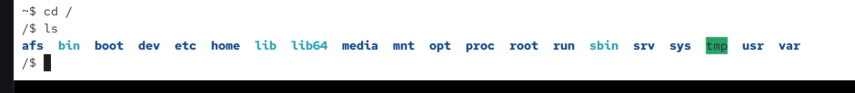
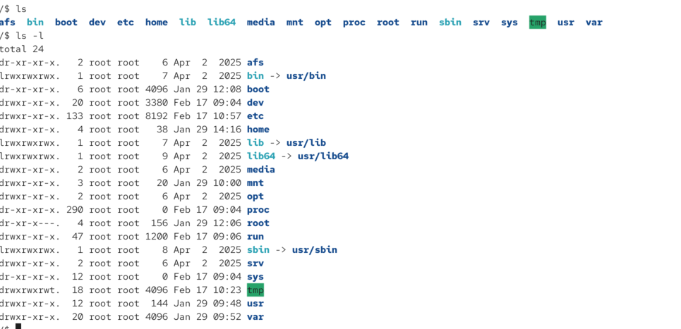
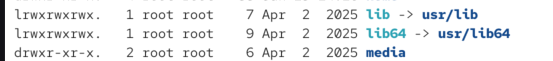
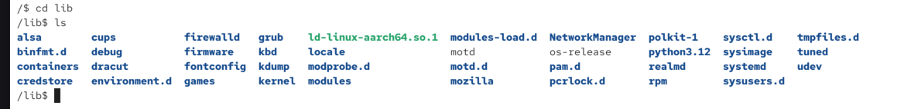
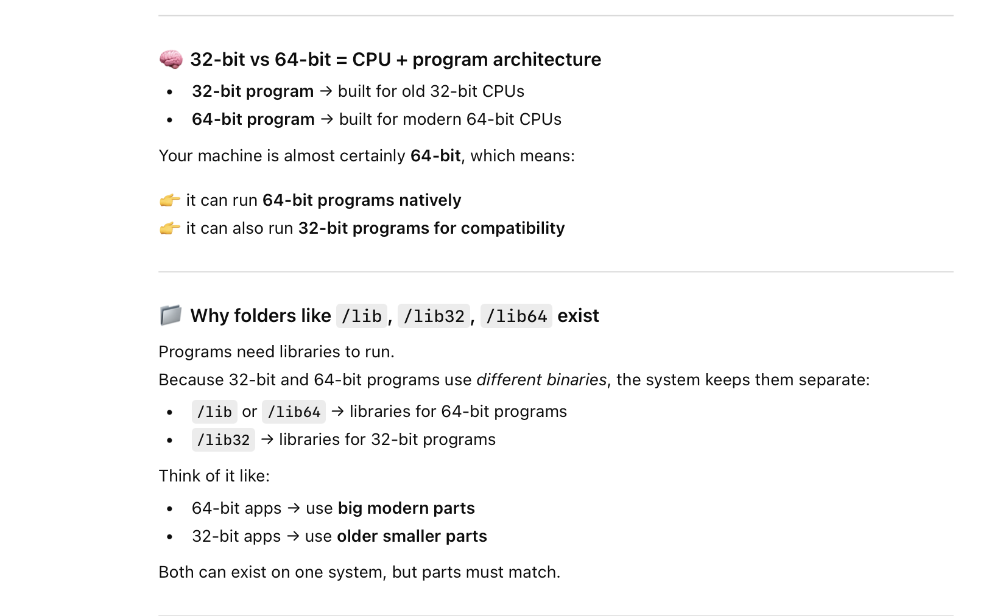
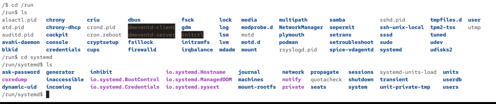
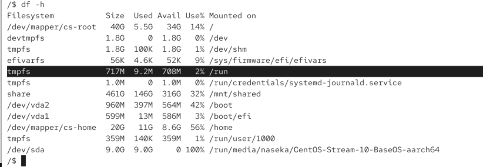
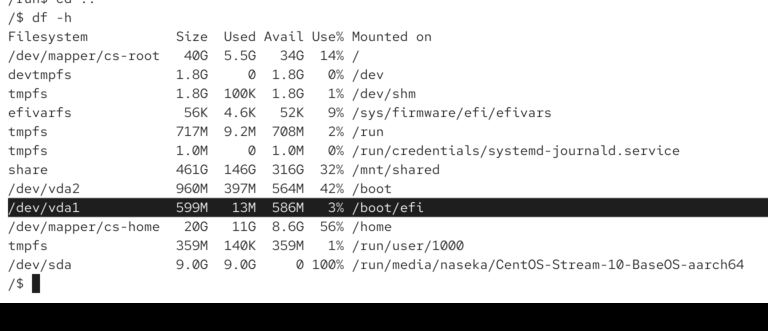
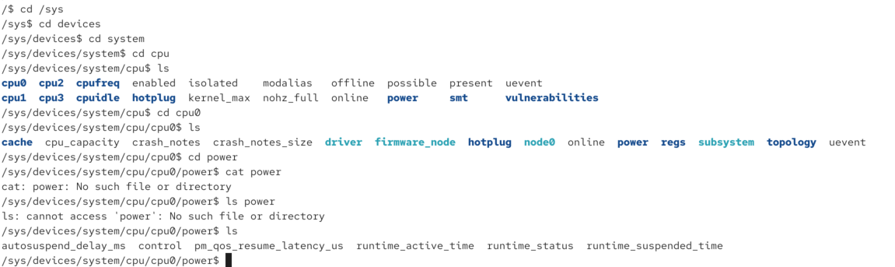

# Filesystem Hierarchy standard:

defins the directory structure and directory contents in unix like os

provides consistent and predictable location for a specific types of fils

# Important folders in root directory

## root

`/`

## bin

`/bin` contains essential command binareis for users

we can see that bin is a simlink urs/bin

## /boot

contains files for the bootloader

## /dev

contains deevice files that represent hardware and software devices 
for ex. /dev/null dev/tty etc

## /etc

contains system-wide configuration files and directories (usually config files are text fiels). 

for ex vpn config, pythin config, systemd (responsible for booting our system - so systemd will do everything to start our system)

## /home

contains personal directories for users (if our system is supposed to have users)

contains user-specific settings, docs and files

## /lib

contains library files that supports the binearies located under /bin and /sbin

if additional libraries for bin and sbin-> they will be here.

nowadays also being mergid into usr/lib (so simlinks)

we can have addiional like lib32 or lib64 : so my computer allows to run 64 bit programs or 32 bit programs:

## /media

contains mount points for removable storage media (for ex. usb card. so if we connected ssd card -> it will be shown in the path root/media/username/myssdfile)

## /mnt

contains mount points for additional filesystems (for ex. we have second drive, then we would use that folder)

## /opt

optional application sofware packages 

there might be some apps installed to /opt but on linux not many.

on mac additional sofware we isntall will show up in /opt -> not really part of os, but we want to use them

## /proc

virtucal filesystem (usually procfs

## /root
contains personal data for the root user (home folder of the root user)

## /run

runtime data

files here will be removed on the shutdown:

temporary files which we need to have which will dissapear on shutdown or on next boot:

so its used for that reason a lot

those are temporary files:

this one is a special boot partition:

## /sbin

similar to /bin

contains essestnitla system binaries that are generarlly used by root user. so those are programs admin use (merged into /usr/sbin)

## /srv

files for services (if we dont store them in /var)

## /sys

info about devices, drivers and kerner features:

# /tmp
contains temporary files

for ex. we have a webserver it might be running with php and we offer the file uppload and hte file might be sent to the server and the server might save this file in the temporary file and our app could open that folder and do smth with it, for ex. save it in gallery

only certain systems should be able access their tmp folders related to them

# /usr

a lot of folders were merged into /usr: it contains sharable read only data (it would be ok to copy them to another computer). we dont need to write data into this folder.

# /usr/local:

this is for files that should NOT be shared among different computers. also preferably read only data. but no sharing. for ex. some tools are installed here, cuase you have certificate only for this laptop

#  /var

contains variable data (logs, databases, websites, and emails, among other things). super important for backups. those direactores constantly change.

if we have a web server isntalled -> it will access var/www/http or maybe var/lib (files for databse)

# /snap
each linux distributaiton have their package manager. for ex. in ubuntu firefox is sintalled with snap package and this snap folder is inside of /var.

# lost+found 

not shown in user interface
for ex. if our system will crash and we need recovery -> some files might be lost and some are possible ot recover (will be in lost+found)
