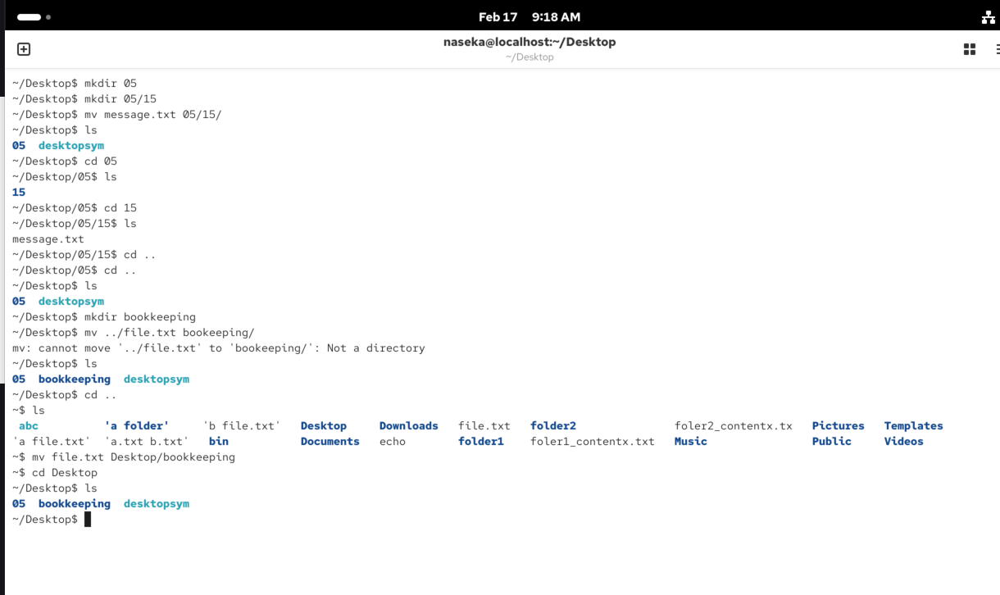
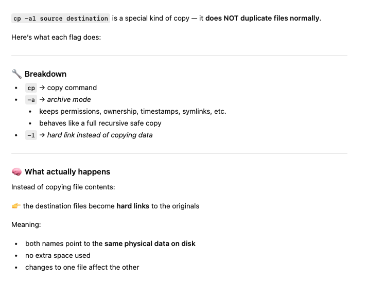
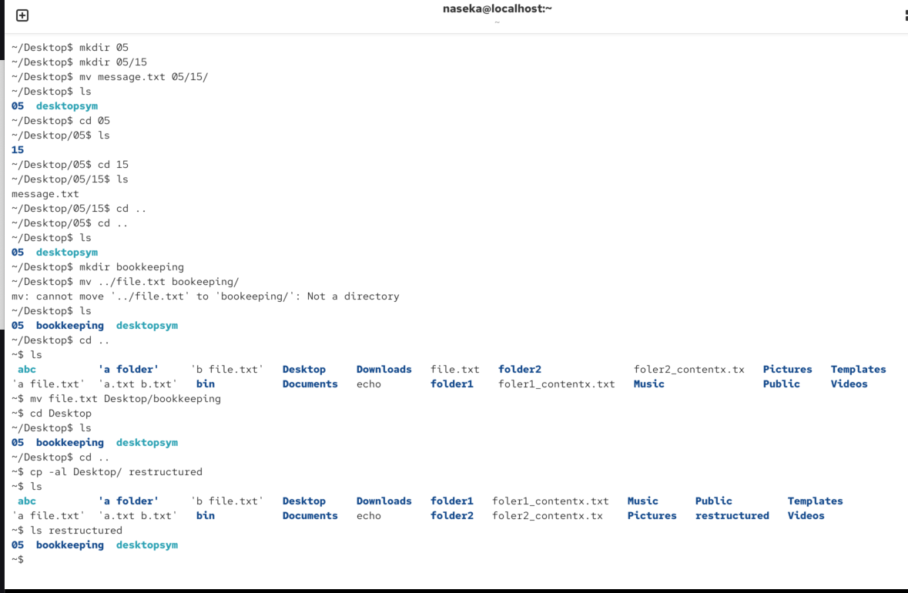

different way to link files

how files stored: files -> referencing inode (stores metadata) -> data on disk

hardlink.txt: follows same inode as the file. inode tracks the number of hardlinks. 

so hardlink.txt = second filename referencing same data.

hardlinks behave as they were the same file. they can only link to files on the same filestystem (simlinks are resolved at runtime). filesystem must support additional hardlinks (first filename is technically also hardlink)

the data are deleted if all hardlinks are removed

# how to create hardlink

`ln target hardlink` 

cannot be created for directories (to prevent loops)

```bash
~$ ls
 abc          'a folder'     'b file.txt'   Desktop     Downloads   folder1   foler1_contentx.txt   Music      Public      Videos
'a file.txt'  'a.txt b.txt'   bin           Documents   echo        folder2   foler2_contentx.tx    Pictures   Templates
~$ touch file.txt
~$ vim file.txt
~$ ls
 abc          'a folder'     'b file.txt'   Desktop     Downloads   file.txt   folder2               foler2_contentx.tx   Pictures   Templates
'a file.txt'  'a.txt b.txt'   bin           Documents   echo        folder1    foler1_contentx.txt   Music                Public     Videos
~$ ln file.txt Desktop/message.txt
~$ ls
 abc          'a folder'     'b file.txt'   Desktop     Downloads   file.txt   folder2               foler2_contentx.tx   Pictures   Templates
'a file.txt'  'a.txt b.txt'   bin           Documents   echo        folder1    foler1_contentx.txt   Music                Public     Videos
~$ ls -l file.txt
-rw-r--r--. 2 naseka naseka 15 Feb 17 09:12 file.txt
~$ cd Desktop/
~/Desktop$ ls
desktopsym  message.txt
~/Desktop$ ls -l
total 4
lrwxrwxrwx. 1 naseka naseka  2 Feb 16 11:15 desktopsym -> ./
-rw-r--r--. 2 naseka naseka 15 Feb 17 09:12 message.txt
~/Desktop$ vim message.txt
~/Desktop$ cat ../file.txt
this is a file harlink
~/Desktop$ 
```
now we have same file in two different folders (one is our regular folder) and another directory has files organized based on the date (those are hardlinks to the first folder):



we can also copy file with hardlinks

`cp -al source dest`



this will copy the whole source folder and create hard links for all files (we will not need additional storage for this) -> this could be starting point to organize our work to different structure




