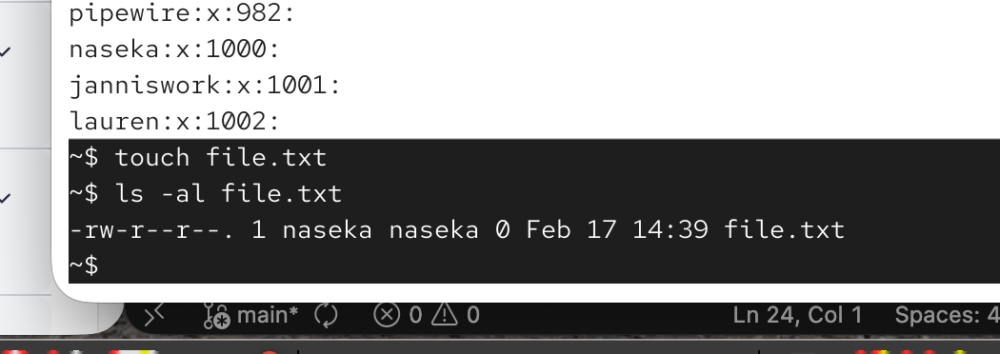
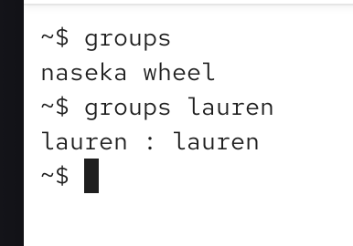
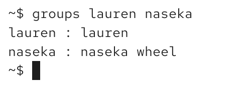

# the help us with:

* organizing users with similar access rights

* symplifying permission management

* enahincing collaboration and resource sharing

* contrlling access to files and directories

# how do groups work

each user has a primary, and zero to many secondary groups

## primary group:
stored in /etc/passwd
default ownershipf for new files

we can test this 

we can see that the user and the usergroup controls the file:

## secondary group:

we can allow multiple membership

stored in `/etc/group`

`groups [username]` if no username -> it will be my groups

asking for multiple users:

## existing groups in Ubuntu

`root`: gives this group admin privileges. there can only be one group, howewere users can be assisocated to this group

`sudo` / `wheel`: members can use sudo

`adm`: allows memenbts to read log files /var/log/syslog

`lpadmin` or `lp` :members can manage printers

`www-data` grop for web server proccesses

`plugdev` allows this user to manage pluggable devices (usb sticks, external HDDs)