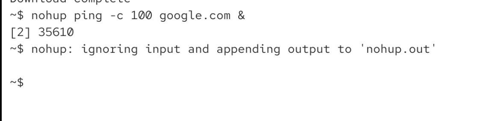
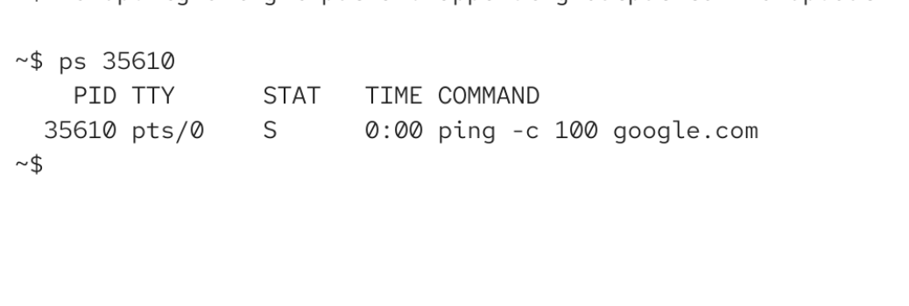
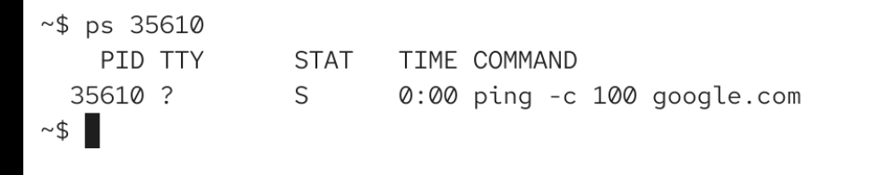

# nohup

keeps a program running even if we close our terminal

`nohup ping -c 100 google.com &` this will start the program ping in the background and it will keep running even if we close our terminal (or log out)

for ex. if we have a really long script whicih takes ages to execute

nohup will also redirect standard output: it will create a file nohup.out in the current folder or in the home directory if current directory is not writable

then press enter again:

if i quite my bash or close the terminal window. process will still be running. you can see that tty now shows ?

so now the program is completely independent .

# nohup vs &

`nohup ping -c 10 google.com` this disoneccts the ping program from the sighup signal (other signals can still reach the program) ping is still foreground process.

`ping -c 10 google.com &` ping launcehd as a nackgrpund process for our current terminal. it will terminalte when we claose the terminal (cause it does reieve the sighup signal), but it doesnt recieve keyboard input (so sigint will not work ctrlc wont work)

`nohup ping -c 10 google.com &` comnbination of above: bacgkround, so it wont recieve keyboard input. nohup will disconned the program from sighup, wo it will keep running even when terminal closed