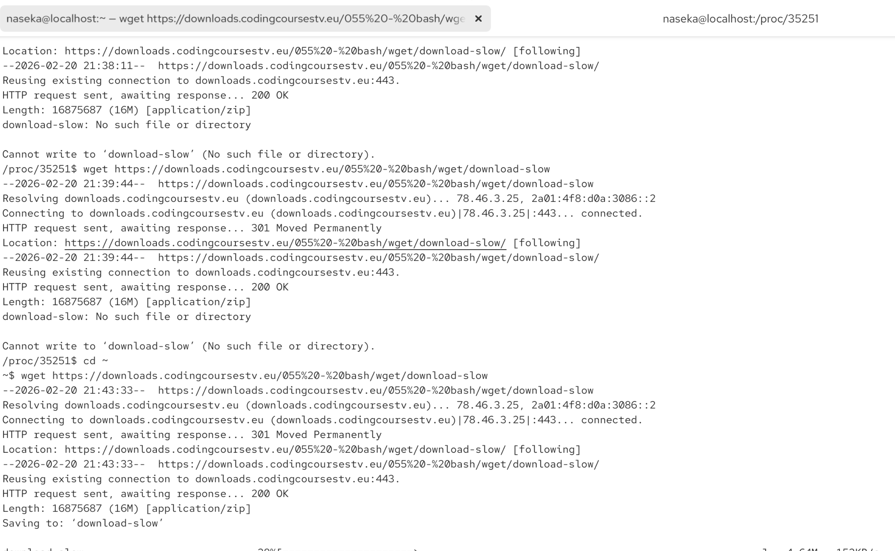
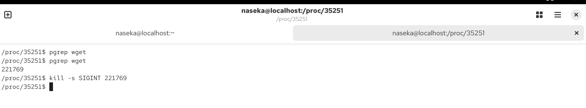
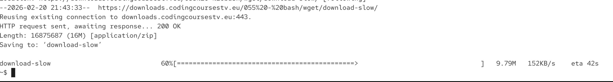

we can use this link to practice 

https://downloads.codingcoursestv.eu/055%20-%20bash/wget/download-slow

we can send signals from other places to a process. for ex. from different terminal.

program is called kill, but all it does is to send signals to program and those programs or kernel do the rest. so its not actually killing programs themselves.

kill -s [SIGNAL] [process-id]

`kill -s SIGINT 12345`

i started wget download in my terminal:

i opened another terminal, found wget process id and sent kill signal:v

we could also do `kill -s SIGINT $(pgrep wget)`

then i checked my previous terminal and i can see that download was stopped:

