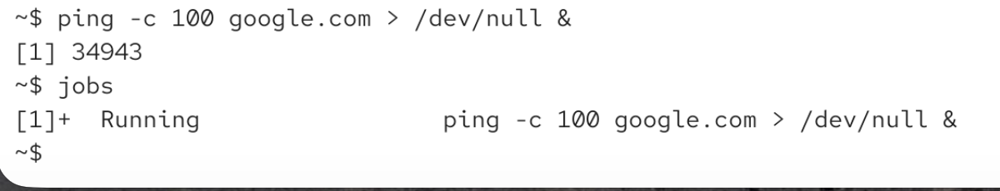
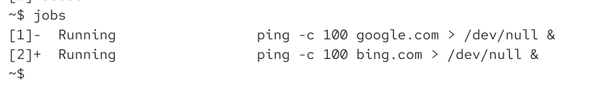
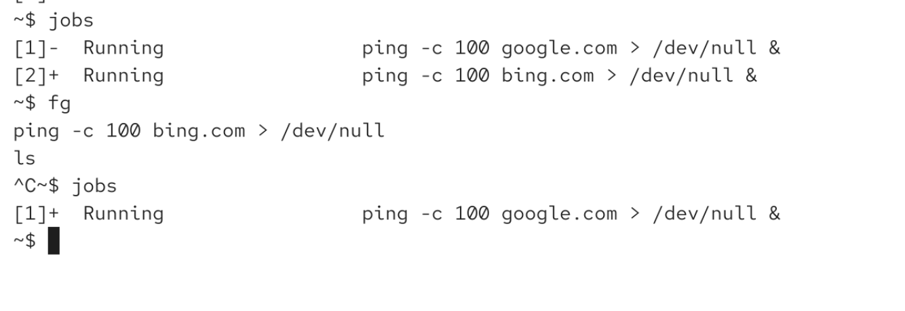
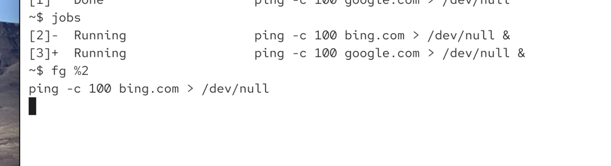

# how to have overview of background jobs

`jobs` it will print all the jobs that are currently running

we are discarting out put here to /dev/null:

# how to bring background job to foreground

`fg [%job-ID]`

if its just one job, then `fg` is enough

if i just run fg -> i will put + command will be in hte foreground:

# important

only foreground jobs can receive keyvoard input

also means htat ctrl c will not work for background jobs (so signals will not work for backgorund jobs)

