# how do users in linux work

## root user

has the highest privelegs
it has the user id: 0 
there can be only one user with this preveleage

## regular users

limited privelegs
we can allow regular usera to temp get root access through sudo

## service users

for specific tasks
this allows us to safely run a webserver, database..

## groups

all users have a primary group

and can be assigned to zero to unlimited addtional groups

# managing users

on linux user info is stored in

1) `etc/passwd`

contains basic user account info
username, user id (UID), group ID (GID), user description (full name), home directory and default shell. 

it doesnt contain password (name is confusing yes..)

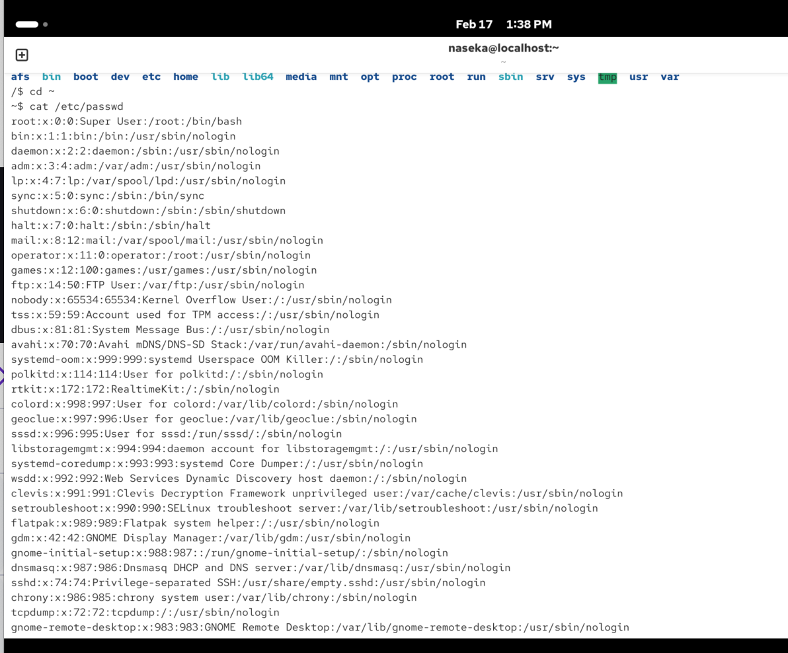

we can see root user, path to default directory and default shell

there are many users, but we cannot login with them.

for ex sshd: we can see that it has no login shell, so we cannot login. or we hae systemd-timesync - here we also cannot login. its about time synch and when we need to change time

2) `etc/shadow`

this file has encrypted user passwords and password aging info
also stores additional info, such as the date of the last password change etc
only root can access

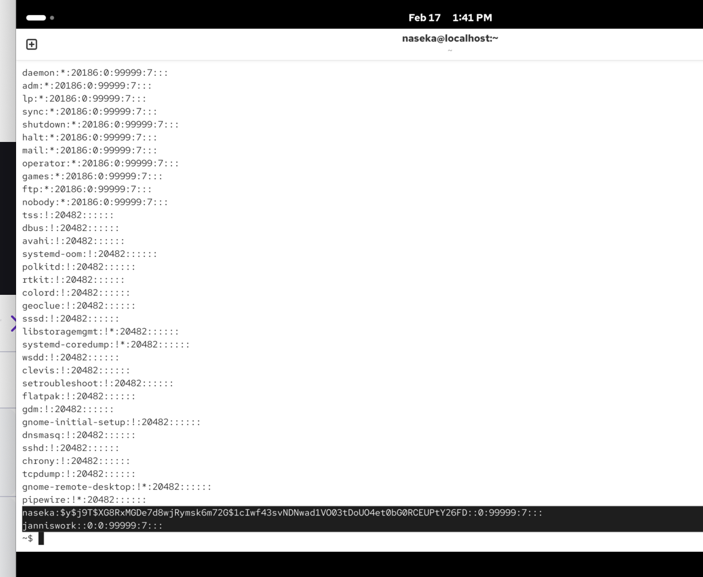

i can see that some users have passowrds here (for ex. naseka). its decrpt passowrd. 

root user has a star instead of password -> so in my case i cannot login in as a root user. 

3) `etc/group`

info about the groups and their members

readable by all users

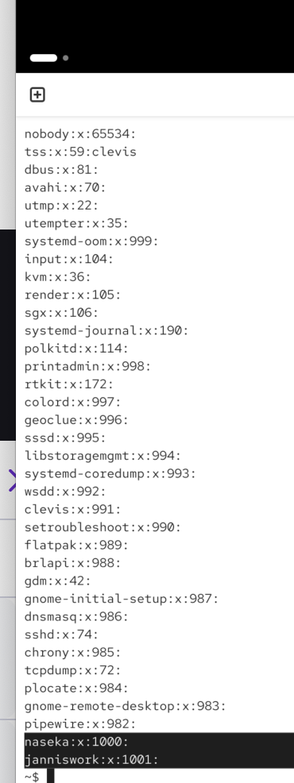


# ho to add users

`useradd`

`-m`create home directory (usually the case, when the user should be able to login)
`-d` set custom home directory
`-s` specify defualt shell, otherwise will use system default standard shell

users without home directory: fpr ex. server users

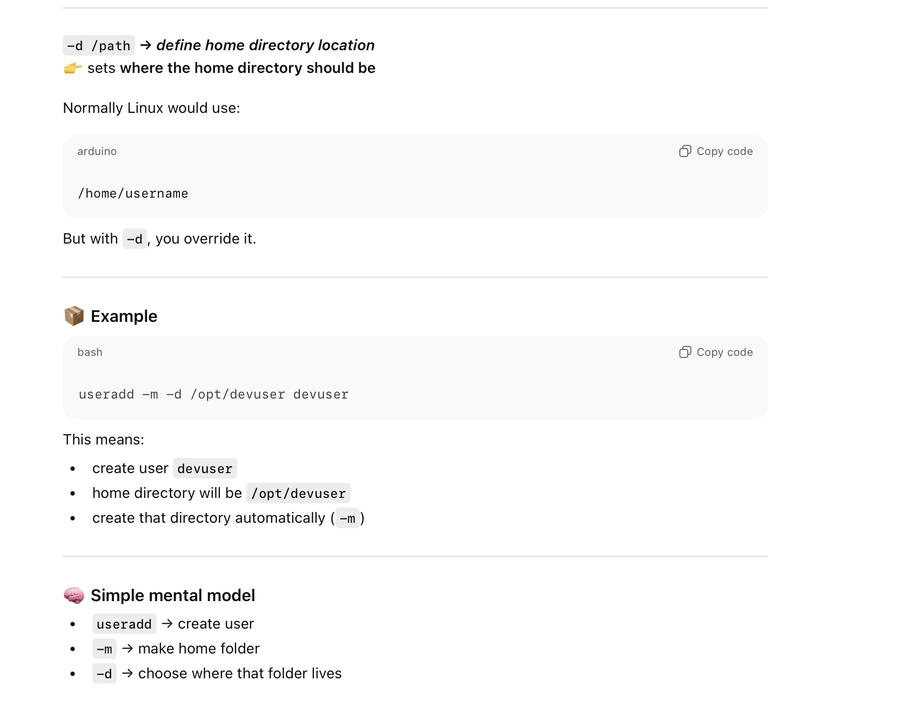

# manage groups:

`-g`: specify primary group instead of using the default configuration
`-G` add user to seconday groups

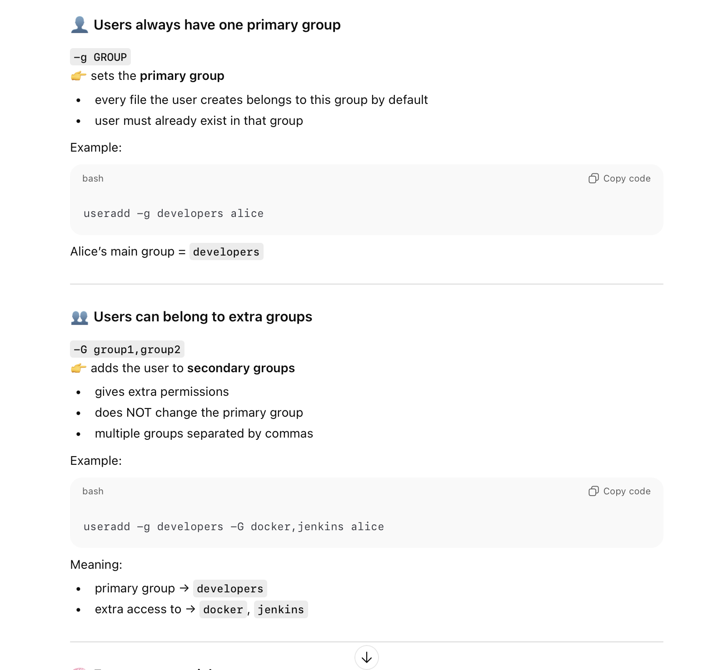

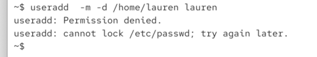

i give sudo

when i run cat /etc/passwd i can see our user

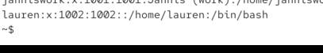

sudo useradd  -m -d /home/lauren laurencat 

/etc/group

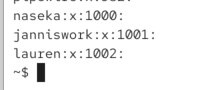

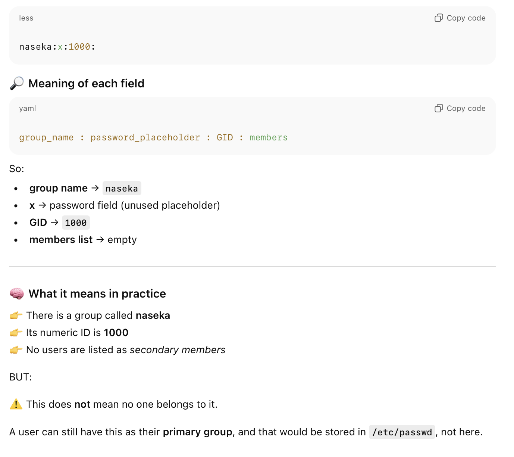

exclamation sign means there is no password and if i try to enter system with any passowrd -> i am not able:

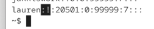

we can see that home folder lauren was created

how to access lauren?

we need to use `passwd [options] [username] -S -d -n -x 
-l :lock
-u: unlock user account

-n : wait this amount of days to change password again so soon
-d delete password
-S :display current status:

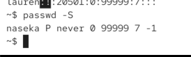

```bash
naseka P never 0 99999 7 -1
```
naseka → username

P → password status
    P = password set and usable
    L = locked
    NP = no password
        So your account password is active.

never → last password change date
    Means the password has never been changed since creation
    (or system doesn’t track it)

0 → minimum days before password can be changed again
    0 = can change anytime

99999 → maximum days password is valid
    Huge number = effectively never expires

7 → warning days before expiry
If password ever expires, user gets warning 7 days before

-1 → inactivity period after expiry before account is disabled
    -1 = never disabled automatically


-1 means if password expires i still can login

L means password is locked:

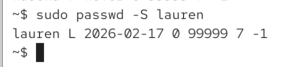

she will be warned 7 days prior expiration


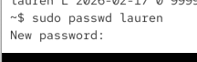

lauren could now change her password herslef in terminal. she might want to use passwd command. she could do it just via `passwd` command

without sudo i have to follow policies for password