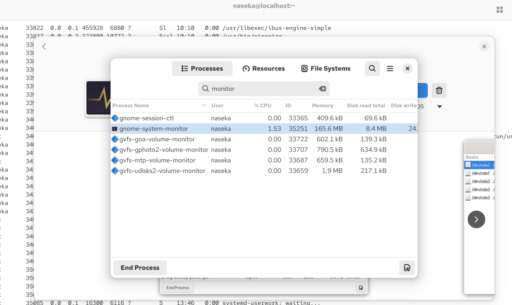
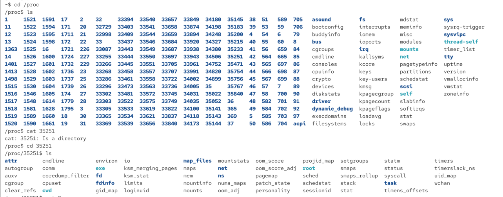
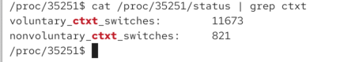
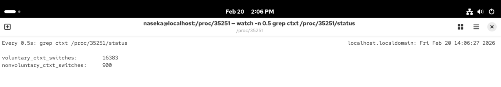
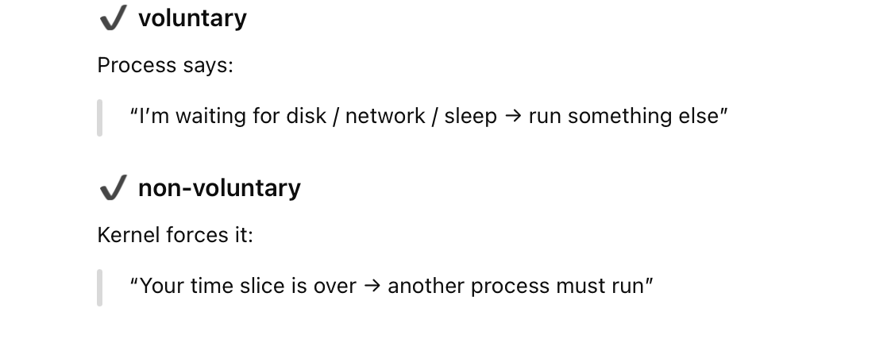

if we only have one cpu in our system
how we can execute multiple programs at the same time?

the idea: we let our cpu switch between those
if we switch fast enoguth itwill seem liek we re running all at the same time

this switching is called sccheduling

# how to inspect it - context switch (ctxt)

i opened system monitor process:








content switches are piling up in time.

# watch command

bash utility to automatically reexecute a command 




```bash
/proc/35251$ watch -n 0.5 grep ctxt /proc/35251/status
```

* `/proc/35251/status` -> its a file that contains info about a process

inside i will find lines like:

            Name:   bash
            State:  S (sleeping)
            VmRSS:  5420 kB
            Threads: 1
            voluntary_ctxt_switches:        125
            nonvoluntary_ctxt_switches:     18

These count how many times the CPU switched away from this process.

* `grep ctxt` -> filters only lines containing ctxt
* `watch` repeats a command again and again
    * -n 0.5 run the command every 0.5 seconds




