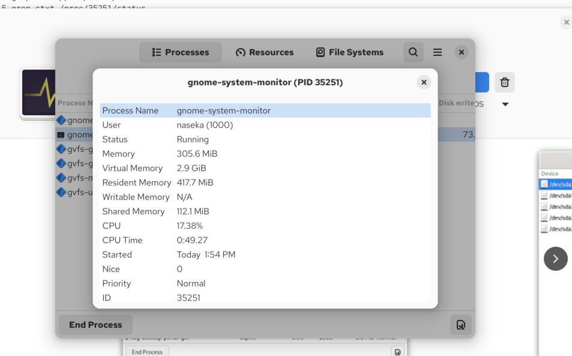
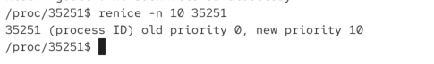
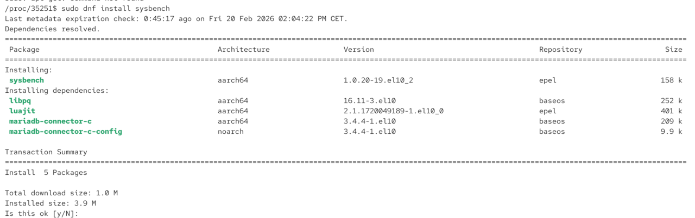
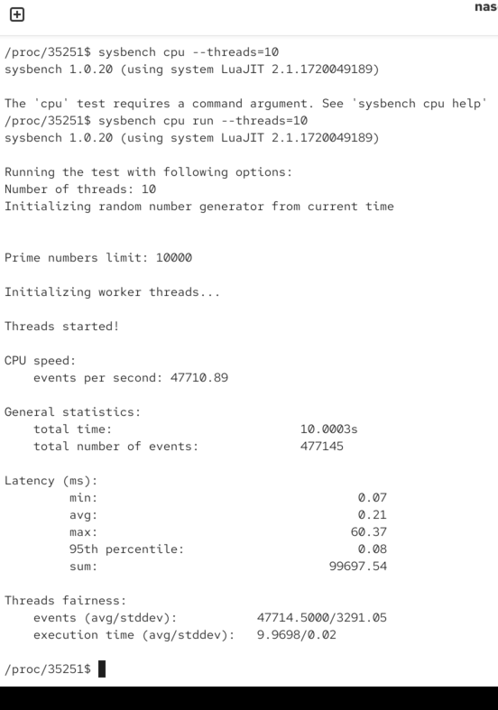

niceness can influence how os switches between proceses

nicesenss ranges from -20 (highest priorirty) to +19 (loweset priority)

default = 0 for new processes

lower niceness receive more time from the scheduler

# hot to set

`nice -n [nicemess] gedit` -> gedit will be launced with nicencess priority (for ex. 19)

# change priority of existin process

`renice`

for ex. running process of program system monitor has nicencess 0:



here we decreased priority



if i want to increase priority (decrease niceness)-> only with sudo we can do it

here we sintalled sysbench

`sudo dnf install sysbench`





# sysbench = stress-tester

its a tool used to test performance of a system mainly CPU, memory, disk and databases. 

used to check:

* how fast CPU calculates
* how fast RAM is accessed
* how fast disk writes/reads
* how database performs under load

it helps to answer questions like:
* is this VM slower than expected?
* did performance drop after migration?
* how many requests can this server handle?

For example:
            generate prime numbers → CPU test
            allocate lots of memory → RAM test
            create files & write to them → disk test
            simulate SQL queries → DB test
            Then it prints statistics.

Sysbench runs synthetic worksloads (fake tasks) and measures time

then we ran the command: run a cpu performance test using 10 parallel workser threads.

```bash
/proc/35251$ sysbench cpu run --threads=10
```
* `sysbench cpu` -> this selects the CPU benchmark module
    * measures raw computer power (purely cpu work while calculating manu prime numbers)
* `run` -> means "start the test now", without run it would only prepare the config
* `--thread=10` -> each thread does its own prime calculations. we want to see how scheduler behaves
2



