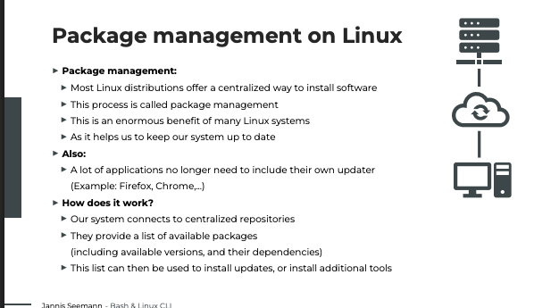
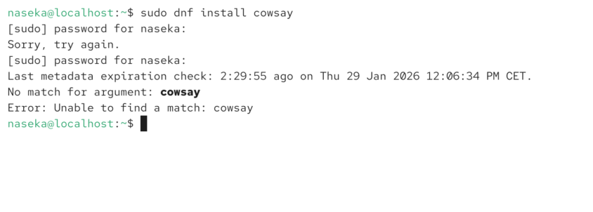
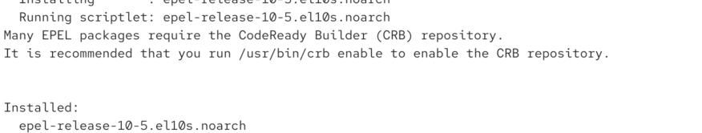
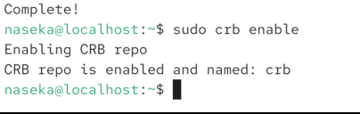
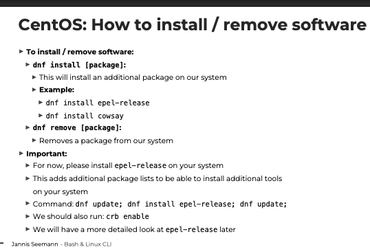

diffeerent distributions have different package managers

yum used to be package manager before for CENTOS. yum older commands still work 

# dnf

`dnf upgrade`

same

`dnf update`

# sudo dnf upgrade

when ever kerner gets updated -> do reboot

# dnf install epel-release

# dnf install cowsay

impoortnat info for later:

but after we install epel-release:

then we do `sudo dnf update`

then again 

and now cow say

# recap of everything and the flow:

