Fedora (not super stable yet) -> CentOS Stream -> RHEL (extremely stable and reliable)

CentOS Stream is a rolling preview of RHEL

RHEL = red hat enterprise linux

# .rpm package format

.rpm its arichive that contain all the files and configuration required to install a software 

we could download .rpm files manually for ex. from https://mirror.stream.centos.org

* we will see file folder for our centos version (for ex. 9-stream/) -> we go inside and we see many folders:

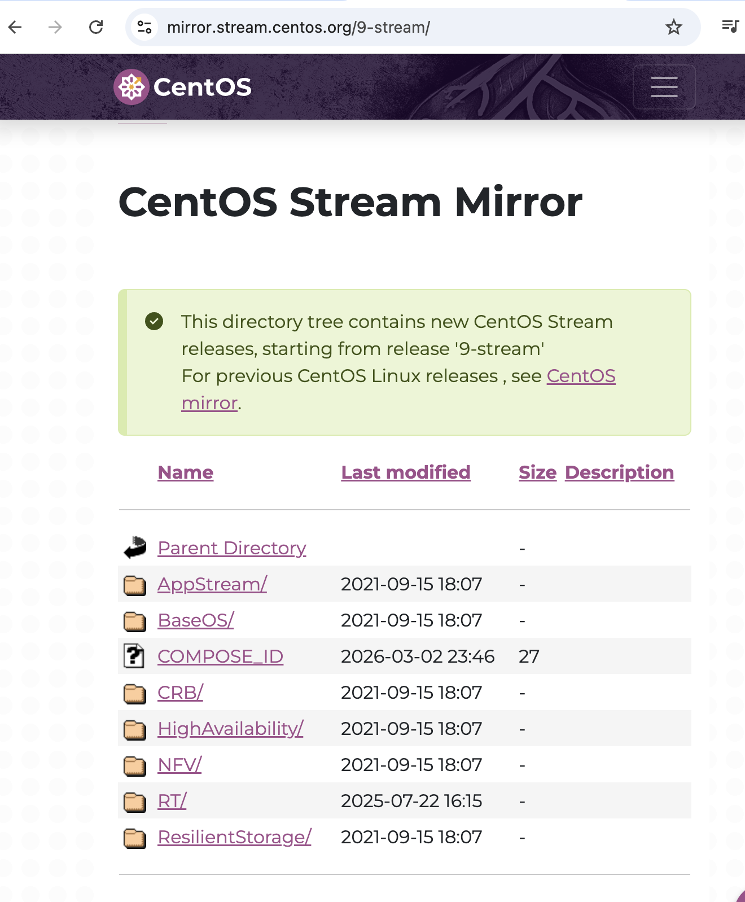

either AppStream/ or BaseOS/

we go to BaseOS/ -> 

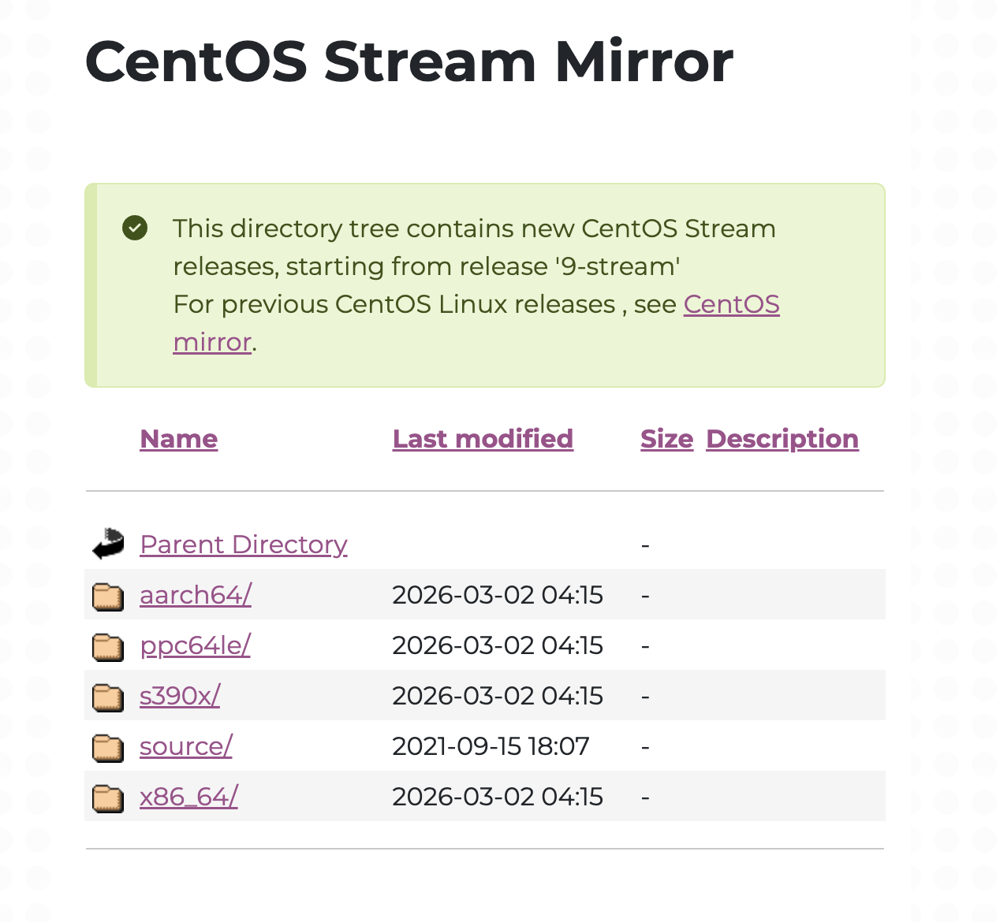

ours is aarch64:
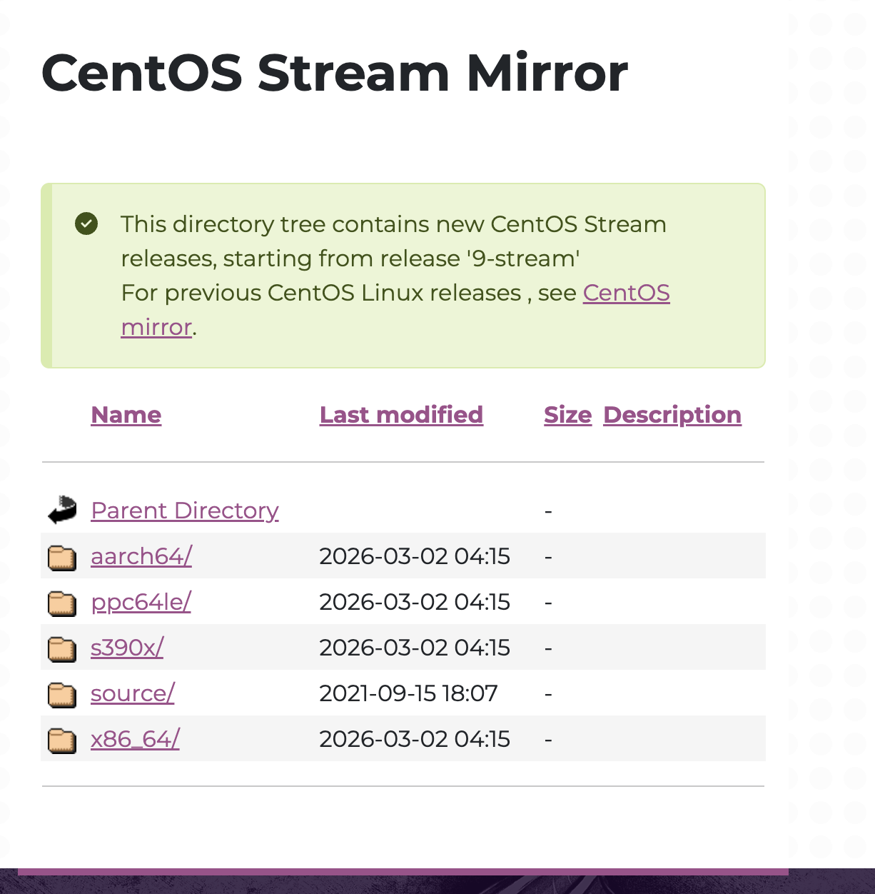

os -> repodata/ (in this folder we have all files our package manager can download)

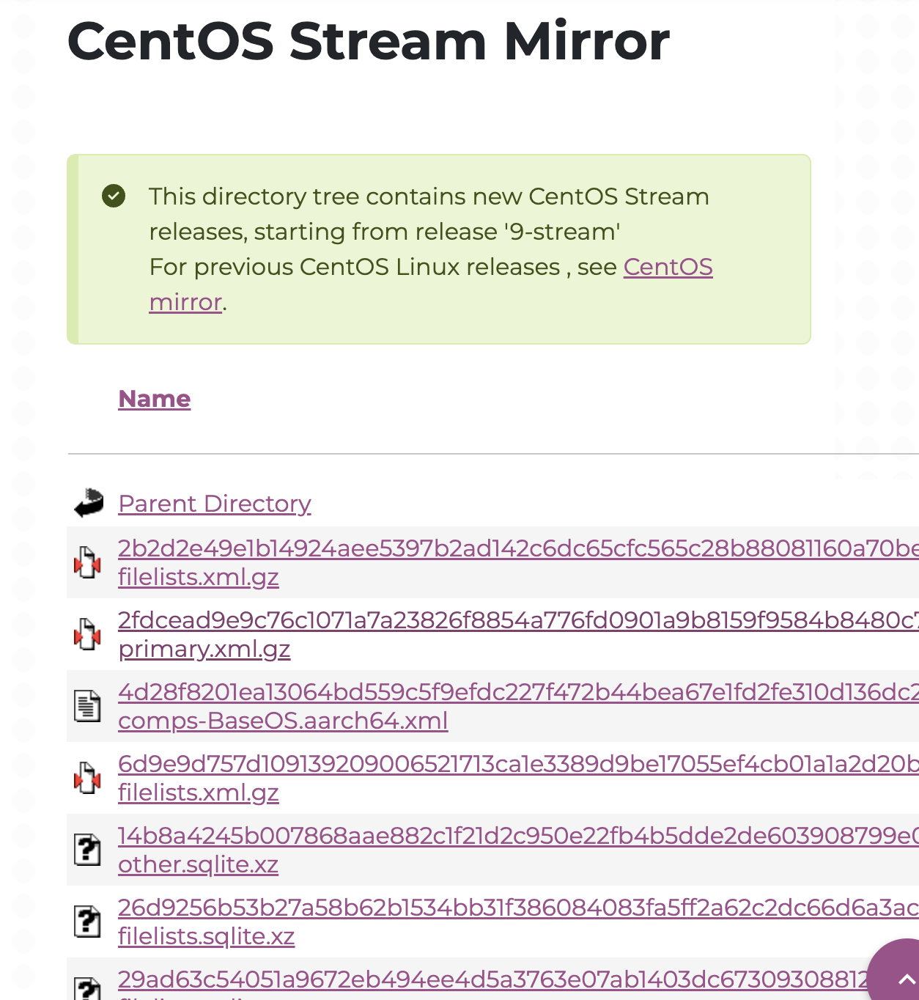

but we need individual packages in os -> packages. here we will see individual rpm packages:

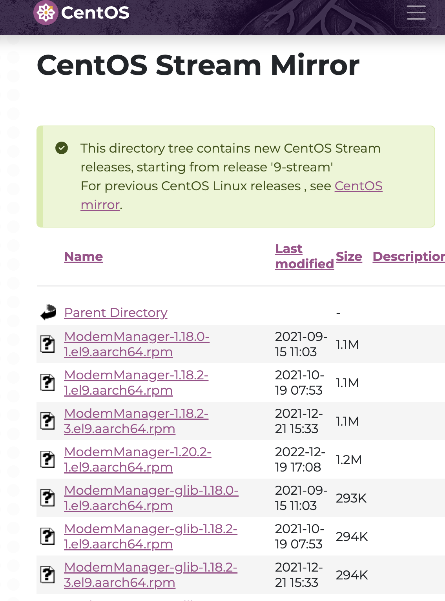

we click on zsh-5.8-9:

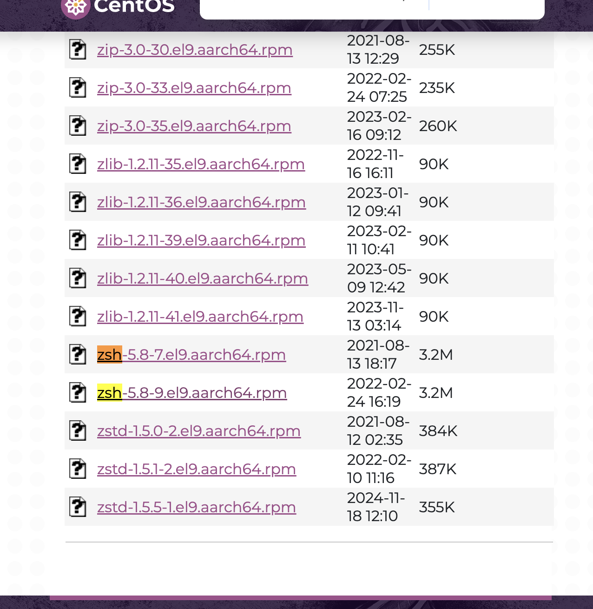

# to inspect rpm package?

`rpm -qpl [file].rpm`

we do everything in centos vm (browser, download etc and the terminal):

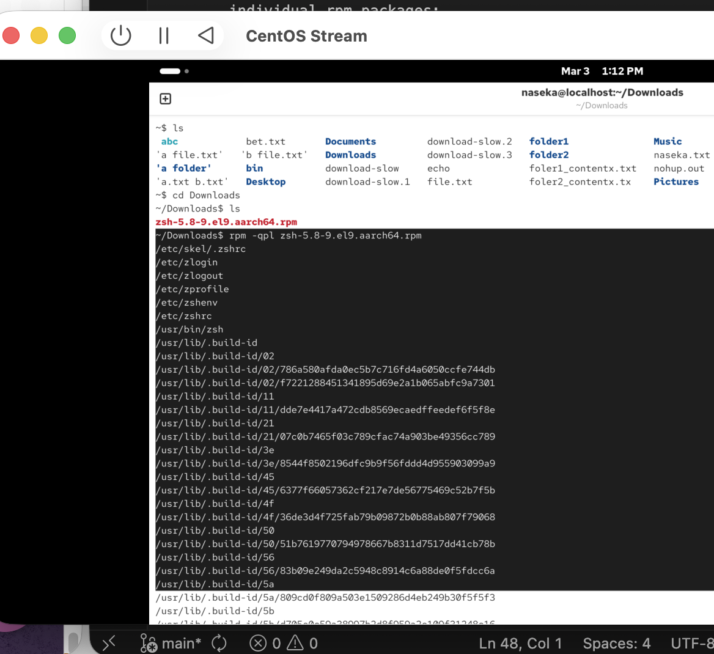

then we could see all those files would be installed on our system if we installed that file.

why rpm -qpl? use helper: rpm --help

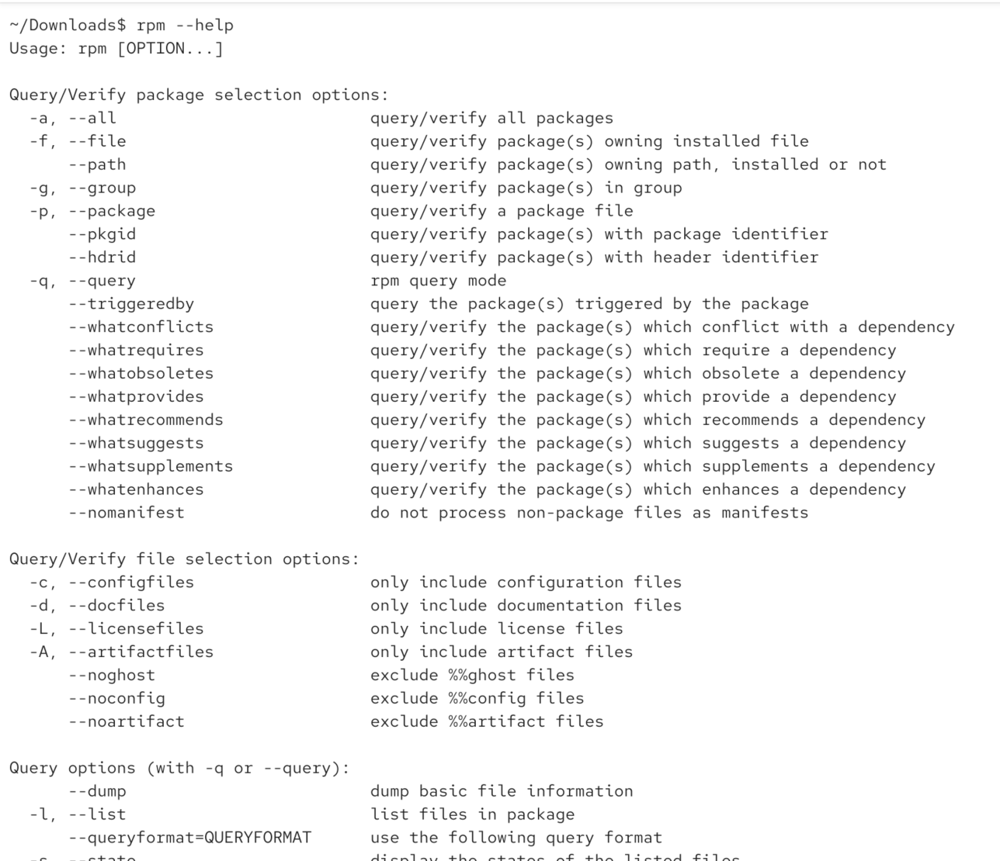

# if we want to isntall

`rpm -i [file]`

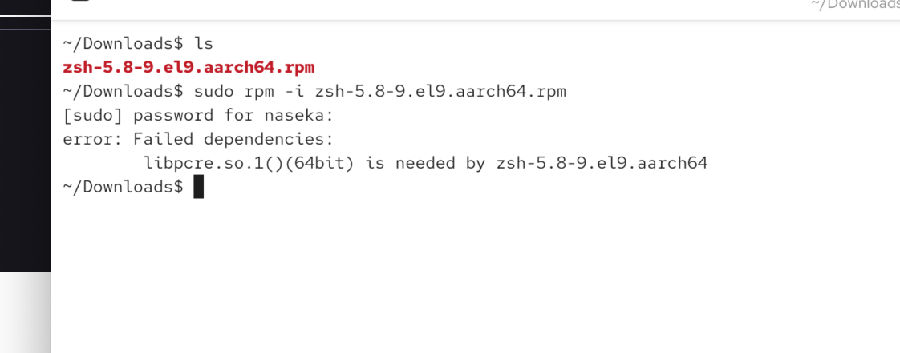

# if we want to uninstall

here we ran into dependancy issue
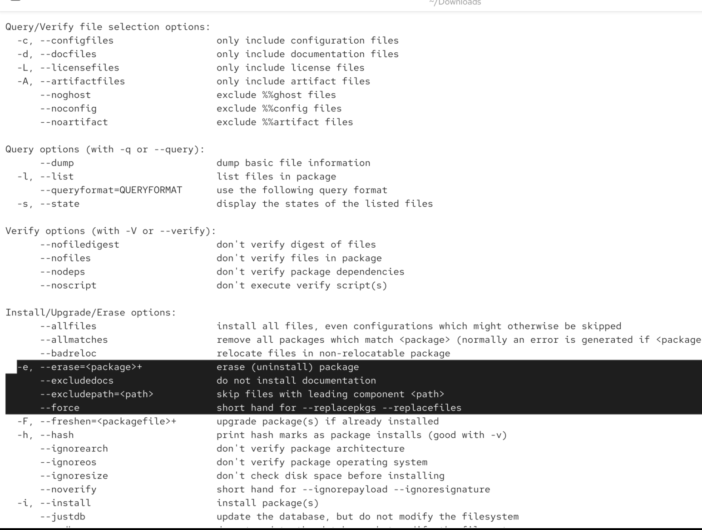

how to inunstall

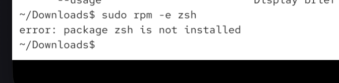

but in general we should avoid downloading manually

