# You can chain multiple commands

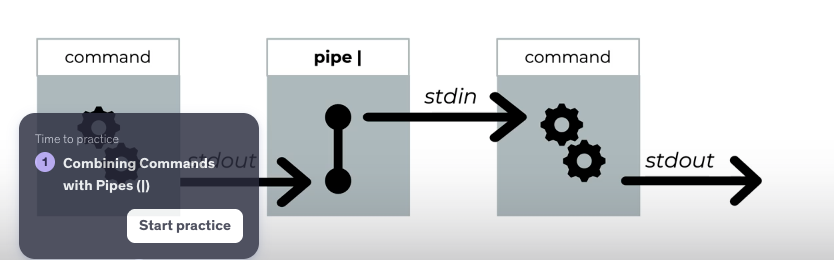

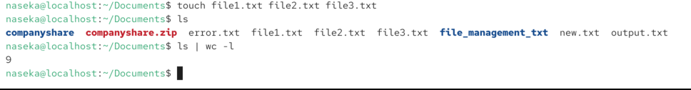

# practicing:

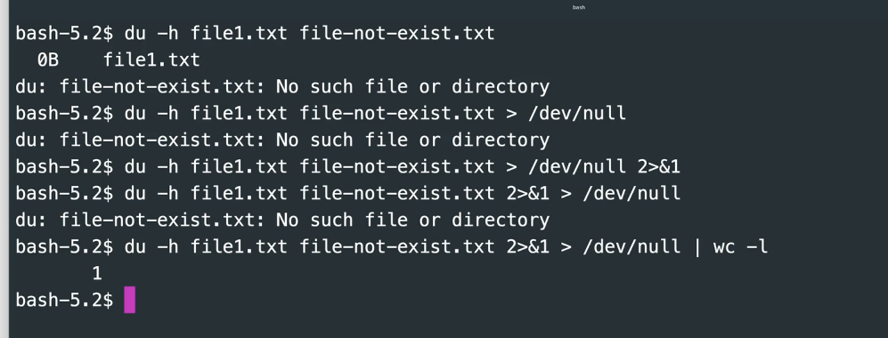

# tee

with combination of a pipe and the tee you can create standard output and write it to a file at the same time

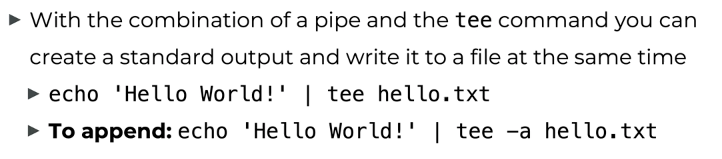

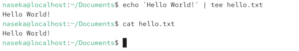

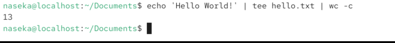

# ping program
ping checks whether another computer is reachable over the network and how fast it responds.

ping = “Are you there, and how long do you take to answer?”

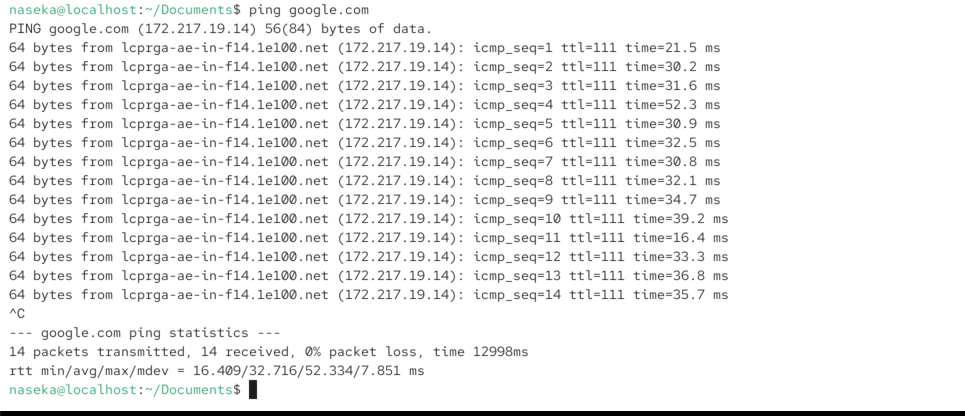

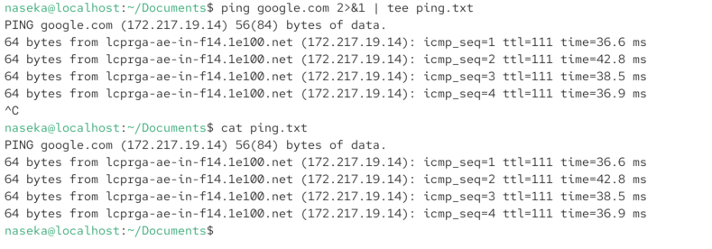

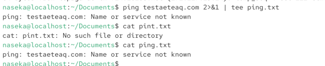

# sort

sort does NOT modify the original file.
It reads the file, sorts the lines, and prints the result to stdout.

sorts by default in alphabetical order

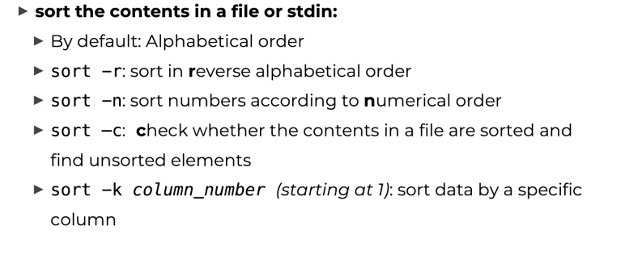

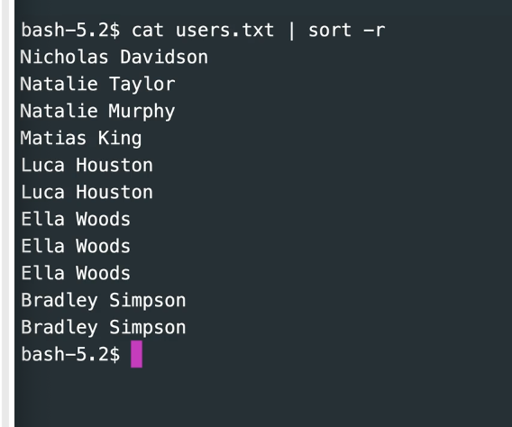

here it will be sorted by last name:

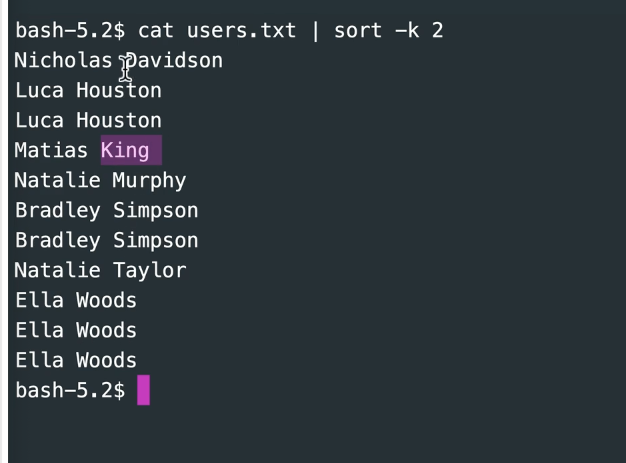

# unique

here we removed dupliccates: if we dont sort data, then we will that duplicates are not removed. unique only rmeoves duplicates which are next to each other.

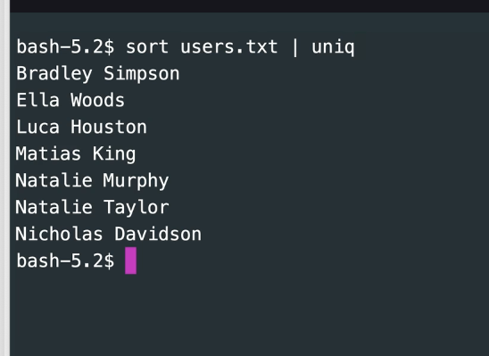

or i could use sort -u

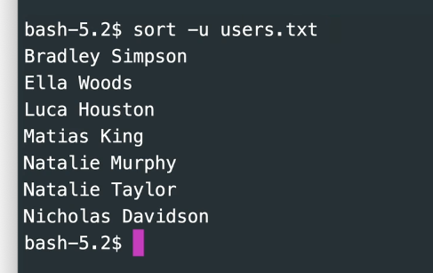

sometimes we dont want to remove duplicates, we just want to know duplicates

here we listed duplicate entries:

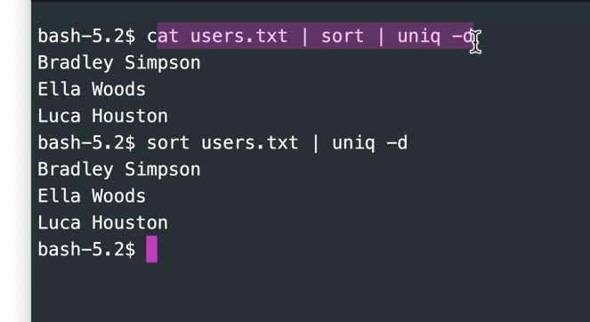

# grep

by default its using basic regular expressions

for now we disable regular expressions for now via `-F` parameters

## grep and binary data

we should not use grep for binary

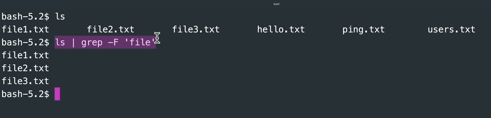

# ip addr show

Shows all network interfaces on the system and their IP addresses.

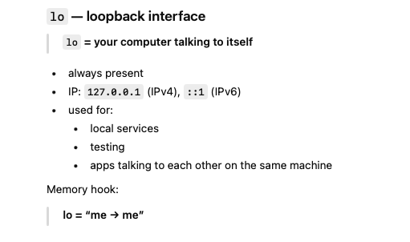

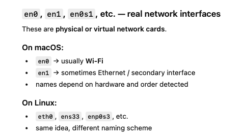

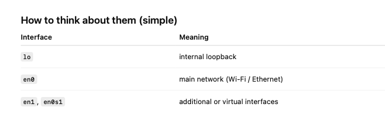

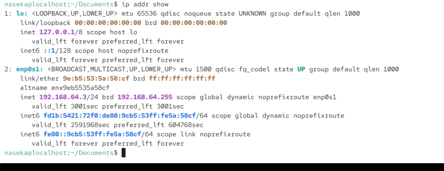

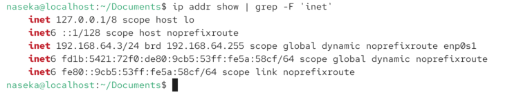

# strings

## tr = translate

replace characters:

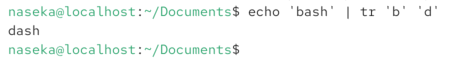

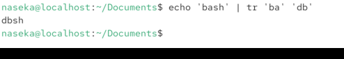

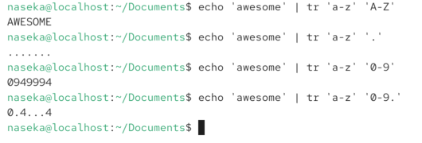

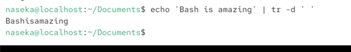

## rev
reversed order of characters

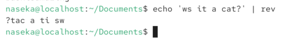

# cut: it cuts the string based on the pipe position
allows to process and extract data from a file or standard input
`cut -b`

## uptime

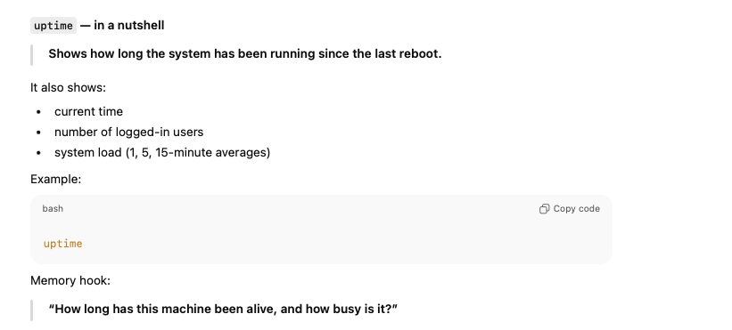

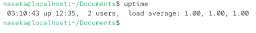

first 10 bites will be shown:

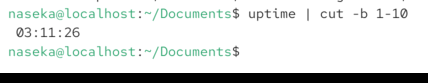

-b = bytes
-c = characters. some characters have 2 bytes (diactrics for ex)

## cutting by fields

`-d` is a delimeter parameter

here we can see that first field is blank asecond field has time

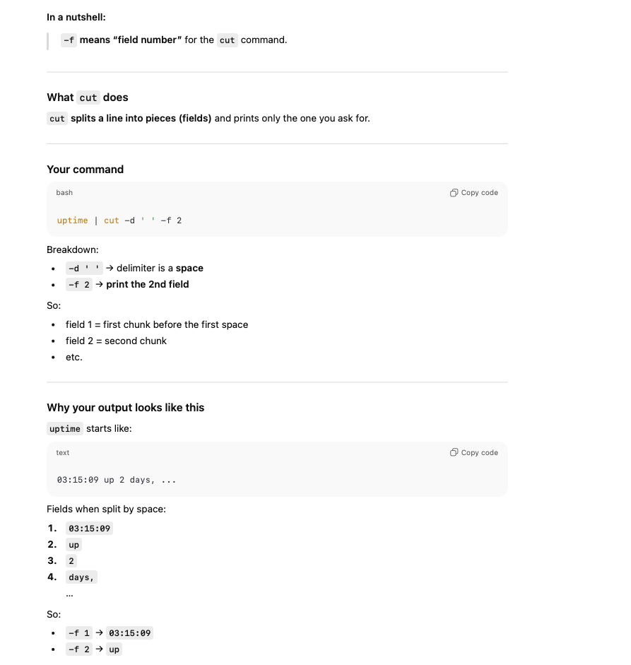

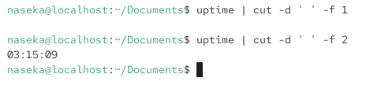

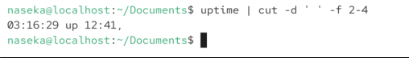

# sed

sed allows us to easily execute commands on a file or on sdin

they can: delete or insert lines; replace lines or part of lines

`s/[pattern]/[replacement]/[flags]:`

`-g` -> all characters. 

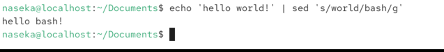

# task: find data in the log file

i ran wget command to have the log file in my vm

then this chaining of commands answered the task.

command:
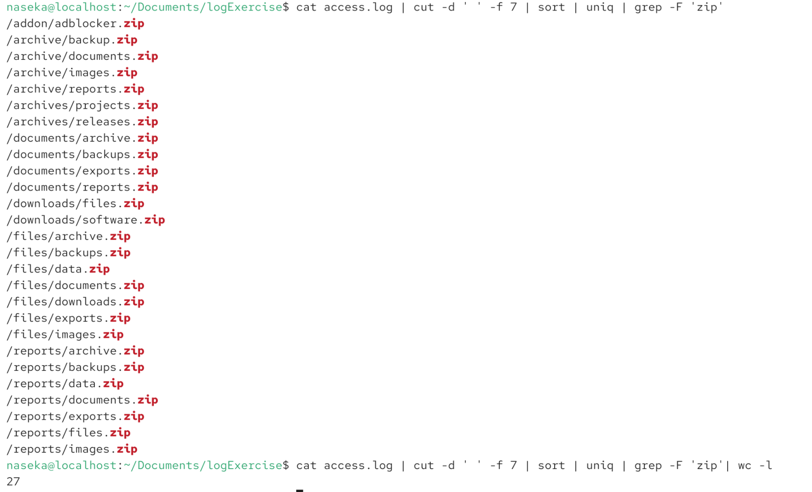

questions which were answered:

