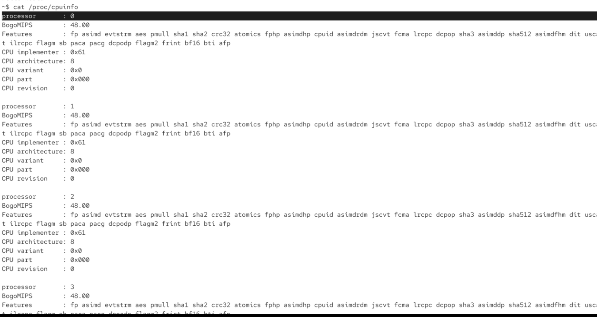
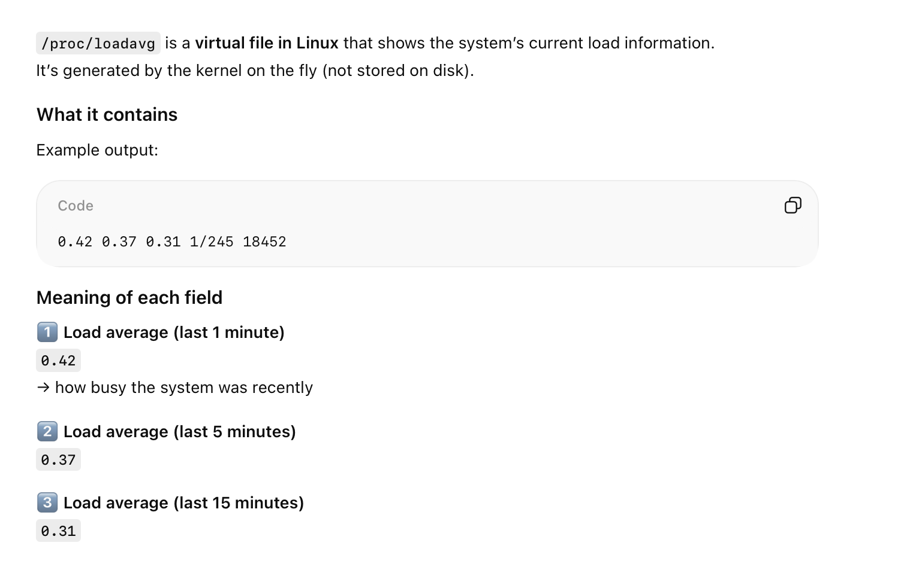

# /proc folder

# proc/cpuinfo

if we want to inspect our system we can look into files in the /proc folder

`/proc/cpuinfo` : contains info on cpu

here is hte main core: processor: 0 (first logical processor)

if there are more cores -> there will be more of them in the output. depends on the processor if it supports this

? i have different view on my vm than my instructor

processor 1 -> next core

etc

model name: here we will see official docs

# proc/meminfo

`cat /proc/meminfo`

# proc/version

we can output rough idea what linux we are running

# proc/uptime

how long system has been up

for all cores

# /proc/loadavg

