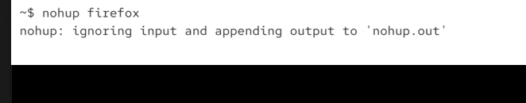
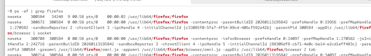
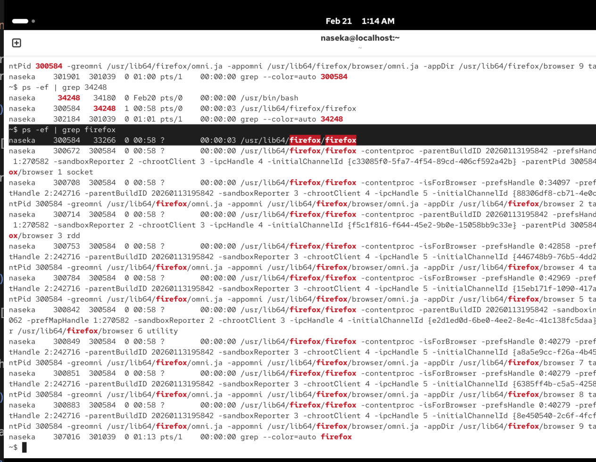
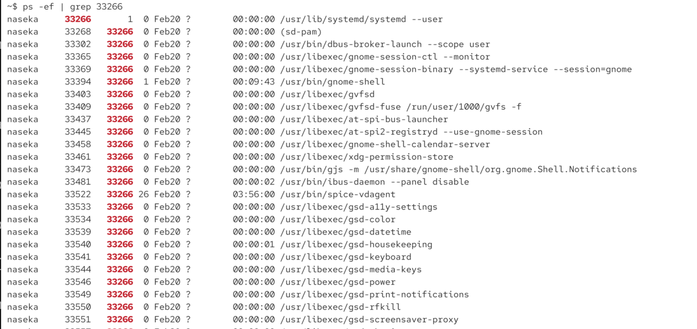
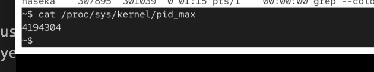

# what happens when a process exits

1) most of resources are made available again
2) parent process: child termination. when a child process terminaltes, the kernel sends SIGCHILD signal to the parent, the parent can then retrieve the child's exit status

we cant fully delete the process (cause parent still might need to be able to retrievde child exit status)

process reaping: parent process uses a system call (wait or waitpid) to collect the child exit status

action is konwn as reaping

i started firefox from the terminal, then closed the program manually, then i can check hte exit code:

`echo $?` // will show the exit code

1 - problem
0 - no errors

sometimes we want to colelct the code and do smth with that

# orphan process:

what if parent shoudl be quit but firefox should still be running

`nohup` = no hangup

orphan = parent process ends before the child, then child becomes an orphan and is adopted by the init process

1) first i nohup firefox:

* nohup firefox -> starts Firefox in the browser
* nohup tells the system: dont stop this process when the terminal closes or SSH disconects -> so firefox keeps running even when:
    * close the terminal
    * log out of SSH
    * lose connection to the server
* output is redirected to a file called `nohup.out`
* when its useful:
    * running long jobs via SSH
    * starting GUI apps on remote machines
    * keeping processes alive after disconnect
* so we start the process from terminal. terminal = parent processs. program = child process. terminal closes -> child should receive SIGHUP signal and usually dies too. BUT with nohup -> if the parent disspears, ignore SIGHUP. 

process id of parent and child next to each other

# process id child and parent

2) first is child  process id and second is parent process id

then i grep parent process id:

3) 

bash in this case would collect the exit code

4) then i close the terminal with firefox
so my firefox became orphan

now i grep firefox agian :

then i check parent id:

we can see its our user systemd process is the parent now:

# zombie prpoces

process that has finished executing but still has an entry in the process table

usually occurs when the parent process hasnt read the childs exit status yet.

usually takes less than a second untill parent reads the exit code.

problem is that zombie processes can leat to process table overflow.

this shows how many processes can be there at the same time in the tabel?

`ps -lef` command will list zombie processes with Z. 

-l = long format

-e = every process (ps shows only processes of your terminal, -e shows all processes on the system)

-f = full format 

removal of zombie process:

usually automatic, if not we can manually reap: we can send sigchld signal to their parent. or we can try to kill the parent process (then the init process will adopt this process, then reap it)
