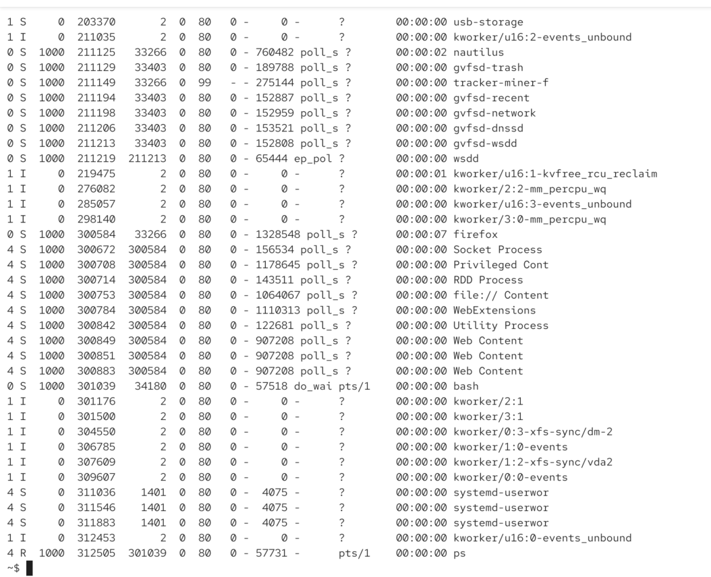

`ps -el`
second column letter is the process state:

`R` = running (for ex. we open a browswer but browser is not doint anygthing, then its NOT in running state, but sleepint state)

`S` = sleeping state (interruptible) = event ready / signal recieved

running means its actibvely being executed

sleeping means it is not doing any calculations on our processor

`D` = uninterruptible sleep (if our program does system call, it wants to talk our kerner, it might be then during system call handled by kernel we are in D state. cause our program is waiting for Kernel, so it cannot receive any signals.)

# problem 

if we have a device driver or a bug in the kernel and system call I/P (D) could not be complete, then we could send SIGKILL

so usually its in D its for very short time

`T` traced or Stopped (when we send signals SIGSTOP, SIGTSTTP)

for ex we do `ping google.com` then we find pid then `kill -s SIGSTOP pid` then we can see that ping ws stopped. then we can `ps -el pid` -> we can see 'T' letter in the second column

`Z` normal state. when program exits, it becoms a zombie

PS: ctrl c doesn work, when ping became bachground process. so he did killall

