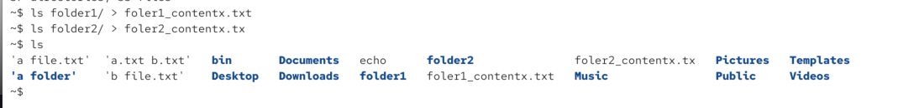
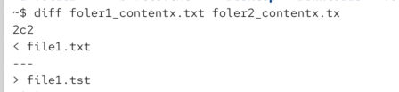
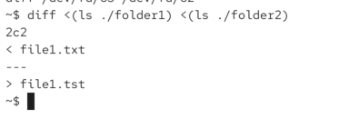
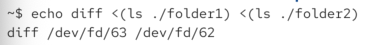
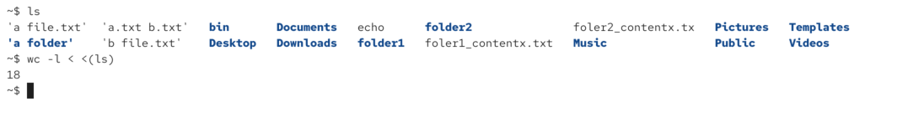
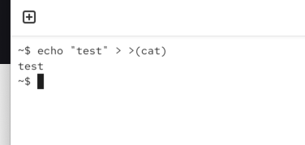

/ means we are indicating htat folder is a directory:

process substitutuion allowd us to use the input or the output of a process as a temporary file

`<(command)`

`echo <(ls)` 

so we dont need to output contents of the folder to a file and then compair two files, we can compair contents right away via temproary files:

here we can see temporary files:

here we can see numnber of lines:

we also can create a temporary file as the input to a command

`>(command)`

here we redirect test to the temporary file which whill be the input to the command

