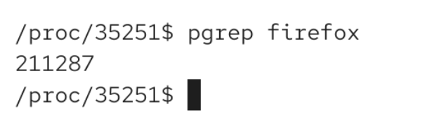
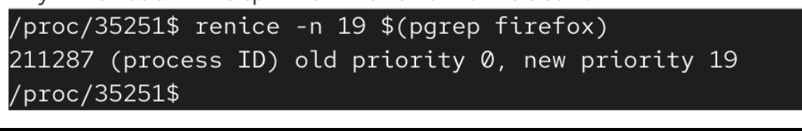

# how to find process id

imagine we had firefox and we set hte niceness. but then we have to do ps -ef, search for firefox and search for firefox process. so its not efficient..

# we had to manually find process id and there is a lot of content we are not interested in

# pgrep 
this allows us to search in our programs and it only returns process id

# example

here we only get firefox process:

`pgrep -f firefox` => will find ALL firefox commands (also webcontents), cause its full name parameter

# how to use it to change priority:

