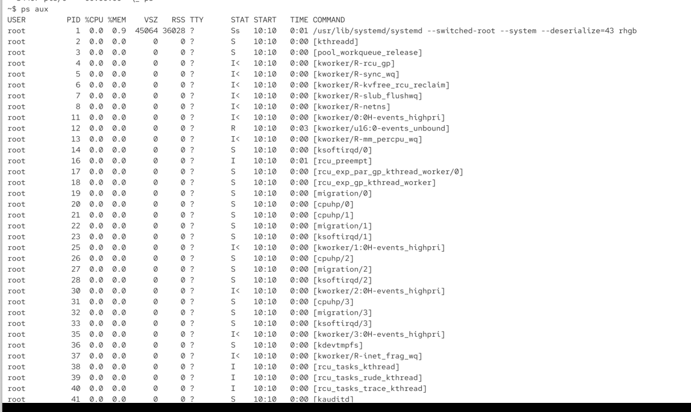

`ps -e -f` -> its unix style parameters
but other way

# BSD style parameters -> parametrs without dash

if we use a bsd style parameter, certain defaults are diffeent

`ps aux` 

a = all processes all users

u user orientd format

x processes outside of a terminal (without tty)

