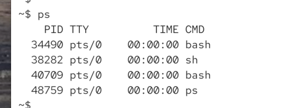
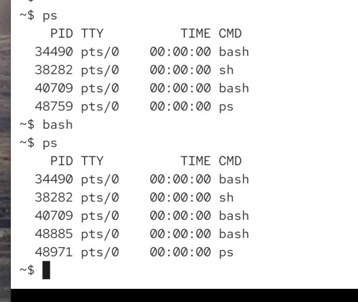
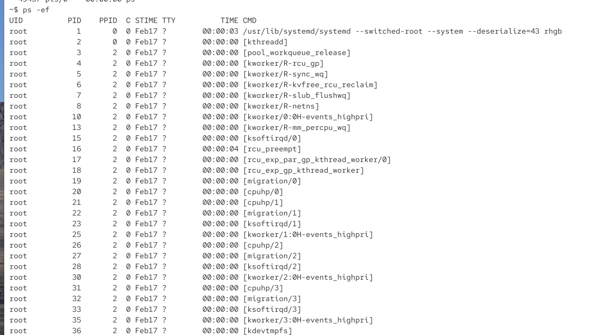
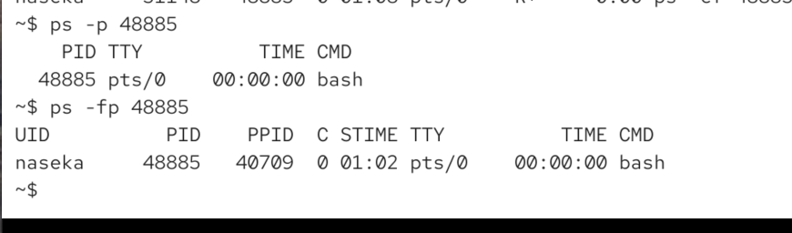
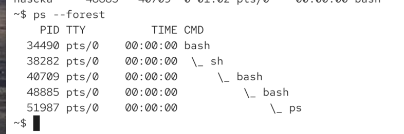
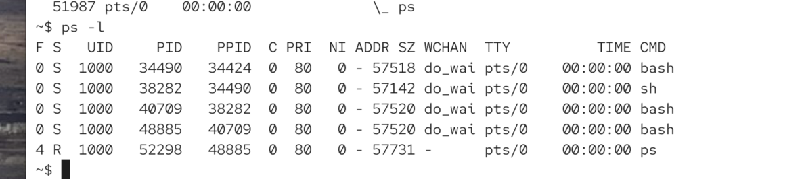

ps = process status

alsmost same on mac and linux

`ps` on linux:

* shows all processes of current. terminal (tty)

if we open extra bashe:

how to displa ALL processes 

`ps -A` or `ps -e` processes from all user all sessions

`ps -f` switch to full format listing (table with also user, terminal and parent process PPID)

`ps -p 1234 1235` only shows 1234 and 12345

`ps --forest` to see the process tree:

`ps -l` show in long format:

