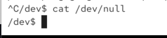
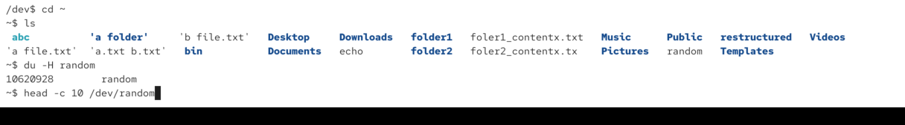
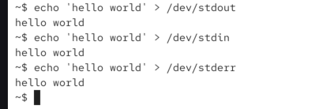

# inmportant ddeices pseudo

## /dev/null

when reading returns EOF (end of file)
when writing Discards the information

output is discarded:

just shows end of file (nothing orinted):

## /dev/random

produces a stream of random numbers
only produces random data, as long as enough "environmental noise" is available

the idea is that we have pure random data, but they are not generated randomly, its data from us

this can run forever:

then we can run this comand to show first 10 lines of dev/random (binaries) - this is used for cryptographic opearations:

## /dev/urandom

it will always produce data (if no more environmental noise available -> it will produce data), otherwise same as random

## /dev/stdin, /dev/stdout, /dev/stderr

input, output, errors

when ever we use for ex echo comand -> it will use stdout file, then it makes sure its shown on my terminal. even if we dont explicitly say > /dev/stdout -> it will still send data there technically when ever output is shown on the terminal

