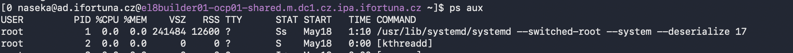
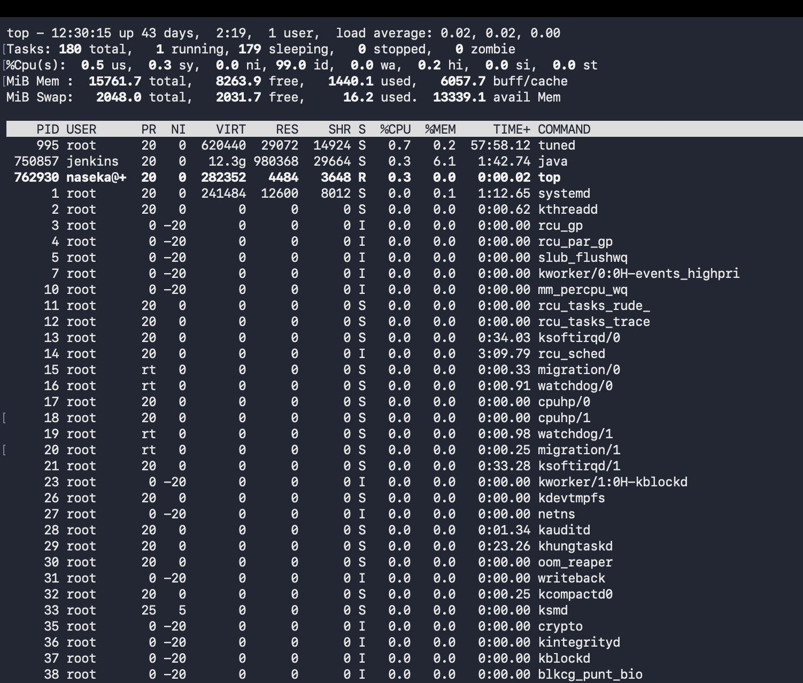
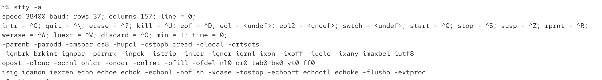
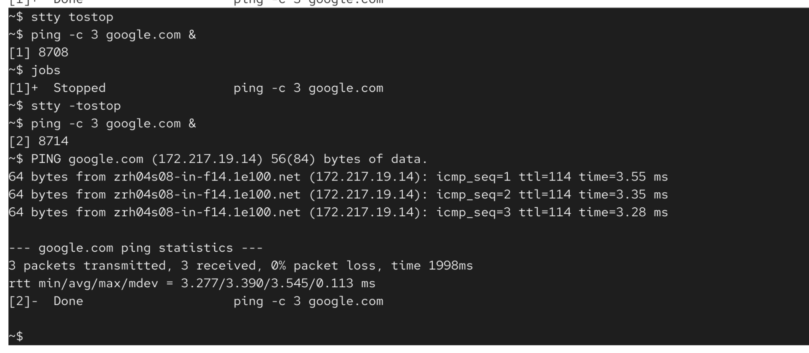
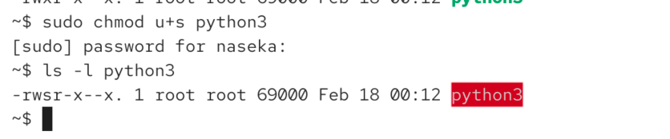
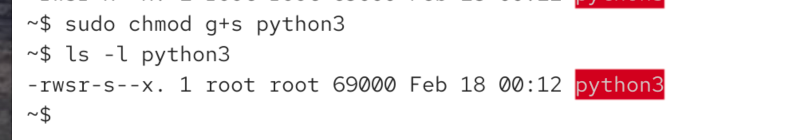

# ping and jobs

```bash
ping -c 25 google.com #Sends 25 ping packets to google.com, then stops and prints packet loss and latency statistics.
jobs #Shows background and stopped jobs in the current shell
wait #Waits for background jobs to finish
wait 123 #waits for process with ID123 (waits till it changes its state)
wait %1 #waits for job with id 1
wait; echo "jobs finished" #will print jobs finished after all jobs are done
fg %1 #Brings job number 1 to the foreground.
bg %1 #Use this when you want to continue interacting with a stopped or background job directly. Resumes stopped job number 1 in the background.
kill %1 #Terminates job number 1.
```

`ctrl + Z => pauses the job`

examples:

```bash
~$ ping -c 30 google.com > /dev/null &
[1] 7187
~$ ping -c 30 google.com > /dev/null &
[2] 7189
~$ ping -c 30 google.com > /dev/null &
[3] 7191
~$ jobs
[1]   Running                 ping -c 30 google.com > /dev/null &
[2]-  Running                 ping -c 30 google.com > /dev/null &
[3]+  Running                 ping -c 30 google.com > /dev/null &
~$ wait
^C
~$ jobs
[1]   Running                 ping -c 30 google.com > /dev/null &
[2]-  Running                 ping -c 30 google.com > /dev/null &
[3]+  Running                 ping -c 30 google.com > /dev/null &
~$ fg %1
bash: fg: job has terminated
[1]   Done                    ping -c 30 google.com > /dev/null
[2]-  Done                    ping -c 30 google.com > /dev/null
[3]+  Done                    ping -c 30 google.com > /dev/null
~$ fg %3
bash: fg: %3: no such job
~$ jobs
~$ ping -c 30 google.com > /dev/null &
[1] 7266
~$ ping -c 30 google.com > /dev/null &
[2] 7268
~$ ping -c 30 google.com > /dev/null &
[3] 7270
~$ ping -c 30 google.com > /dev/null &
[4] 7272
~$ ping -c 30 google.com > /dev/null &
[5] 7276
~$ jobs
[1]   Running                 ping -c 30 google.com > /dev/null &
[2]   Running                 ping -c 30 google.com > /dev/null &
[3]   Running                 ping -c 30 google.com > /dev/null &
[4]-  Running                 ping -c 30 google.com > /dev/null &
[5]+  Running                 ping -c 30 google.com > /dev/null &
~$ fg %5
ping -c 30 google.com > /dev/null
^Z
[5]+  Stopped                 ping -c 30 google.com > /dev/null
~$ jobs
[1]   Done                    ping -c 30 google.com > /dev/null
[2]   Done                    ping -c 30 google.com > /dev/null
[3]   Done                    ping -c 30 google.com > /dev/null
[4]-  Done                    ping -c 30 google.com > /dev/null
[5]+  Stopped                 ping -c 30 google.com > /dev/null
~$ bg %5
[5]+ ping -c 30 google.com > /dev/null &
~$ jobs
[5]+  Running                 ping -c 30 google.com > /dev/null &
~$ 
```

```bash
~$ jobs
[1]   Running                 ping -c 25 google.com > /dev/null &
[2]-  Running                 ping -c 25 google.com > /dev/null &
[3]+  Running                 ping -c 25 google.com > /dev/null &
~$ wait; echo "jobs finished"
[1]   Done                    ping -c 25 google.com > /dev/null
[2]-  Done                    ping -c 25 google.com > /dev/null
[3]+  Done                    ping -c 25 google.com > /dev/null
jobs finished
```

# tput


tput is a command that asks: “What special character sequence should I send to this terminal to do something?”

`tput bold`


`tput bel` 

```bash
~$ ping -c 50 google.com > /dev/null & 
[1] 25125
~$ wait; tput bel; echo "done" #when command is finished, it will ring a sound and print done
[1]+  Done                    ping -c 50 google.com > /dev/null
done
~$ 
```


# reset

`resest` if you type it in terminal and press enter -> eveyrthing will be cleared and reset to default state

# ps aux

example: 



`ps aux | grep jenkins`  -> show me running processes that mention Jenkins

```bash
[0 naseka@ad.ifortuna.cz@jenkins01-ocp01-shared.m.dc1.cz.ipa.ifortuna.cz ~]$ ps aux | grep jenkins # show me running processes that mention Jenkins
jenkins   843829 42.8 65.0 28251856 21243120 ?   Ssl  Jun11 11287:48 /usr/lib/jvm/java-21-openjdk-21.0.9.0.10-1.el8.x86_64/bin/java -Dorg.apache.commons.jelly.tags.fmt.timeZone=Europe/Prague -Djava.naming.referral=ignore -Dcom.sun.jndi.ldap.object.disableEndpointIdentification=true -Dhudson.model.DownloadService.noSignatureCheck=true -Djava.awt.headless=true -Djava.io.tmpdir=/var/lib/jenkins/tmp -Dhudson.slaves.NodeProvisioner.initialDelay=0 -Dhudson.slaves.NodeProvisioner.MARGIN=50 -Dhudson.slaves.NodeProvisioner.MARGIN0=0.85 -Dorg.jenkinsci.plugins.durabletask.BourneShellScript.HEARTBEAT_CHECK_INTERVAL=300 -Djavax.net.ssl.trustStore=/var/lib/jenkins/keystore/cacerts -Xmx16g -Xms16g -XX:MaxDirectMemorySize=4g -jar /usr/share/java/jenkins.war --webroot=/var/cache/jenkins/war --httpPort=8080 --debug=9
```

output means: 
-> Jenkins process owner: jenkins ->  so Linux user running the process is jenkins
-> PID: 843829
-> CPU usage: 42.8%
-> Memory usage: 65.0% -> 65 % of serlver's RAM is used
-> Resident memory: about 21.2 GB -> RSS -> real RAM used by Jenkins process
-> TTY: ? -> Jenkins is not attached to your terminal. Normal for background service
-> Ssl -> S=sleeping/waiting most of the time, s= session leader, l=multi-threaded. Ssl is normal for Jenkins, cause its long-running Java service with many threads.
-> Started: Jun11
-> Total CPU time used: 11287:48 -> CPU time used since its started
-> Java version path: java-21-openjdk -> jenkins is a Java application, so it is started by the java program. many -D are Java settings, those are configuration values passed into jenkins at startup
-> Jenkins WAR: /usr/share/java/jenkins.war: Java is running the Jenkins application file

# variable expansion

`$` is indication for a shell, that we want to access the variable

```bash
~$ echo ${PATH}
/home/naseka/.local/bin:/home/naseka/bin:/usr/local/bin:/usr/local/sbin:/usr/bin:/usr/sbin
~$ echo ${#PATH} #print how many characters my path has
90
~$ echo ${PATH:0:5} #cuts out a piece of a variable
/home
~$ echo ${PATH:1:5}
home/
~$ echo "${PATH}/eka"
/home/naseka/.local/bin:/home/naseka/bin:/usr/local/bin:/usr/local/sbin:/usr/bin:/usr/sbin/eka
~$ 
```

# single and double quotes

single quotes = take everything literally - no expansion
double quotes = still group text into one argument, but allow some shell expansions

# list user accounts

## user types

### 1. Local users stored directly on the server

`cat /etc/passwd` : shows users stored in the local file. those are mostly 
    a) system users (root, daemon, nginx etc)
    b) local human users, if they were created directly on the server (for ex. jenkins:x:992:988:Jenkins Automation Server:/var/lib/jenkins:/bin/false)


```bash
[1 naseka@ad.ifortuna.cz@el8builder01-ocp01-shared.m.dc1.cz.ipa.ifortuna.cz ~]$ cat /etc/passwd
root:x:0:0:root:/root:/bin/bash
bin:x:1:1:bin:/bin:/sbin/nologin
daemon:x:2:2:daemon:/sbin:/sbin/nologin
adm:x:3:4:adm:/var/adm:/sbin/nologin
lp:x:4:7:lp:/var/spool/lpd:/sbin/nologin
sync:x:5:0:sync:/sbin:/bin/sync
shutdown:x:6:0:shutdown:/sbin:/sbin/shutdown
halt:x:7:0:halt:/sbin:/sbin/halt
mail:x:8:12:mail:/var/spool/mail:/sbin/nologin
operator:x:11:0:operator:/root:/sbin/nologin
games:x:12:100:games:/usr/games:/sbin/nologin
ftp:x:14:50:FTP User:/var/ftp:/sbin/nologin
nobody:x:65534:65534:Kernel Overflow User:/:/sbin/nologin
dbus:x:81:81:System message bus:/:/sbin/nologin
tss:x:59:59:Account used for TPM access:/dev/null:/sbin/nologin
systemd-coredump:x:999:997:systemd Core Dumper:/:/sbin/nologin
systemd-resolve:x:193:193:systemd Resolver:/:/sbin/nologin
polkitd:x:998:996:User for polkitd:/:/sbin/nologin
sssd:x:997:994:User for sssd:/:/sbin/nologin
chrony:x:996:993::/var/lib/chrony:/sbin/nologin
sshd:x:74:74:Privilege-separated SSH:/var/empty/sshd:/sbin/nologin
rpc:x:32:32:Rpcbind Daemon:/var/lib/rpcbind:/sbin/nologin
rpcuser:x:29:29:RPC Service User:/var/lib/nfs:/sbin/nologin
unbound:x:995:991:Unbound DNS resolver:/etc/unbound:/sbin/nologin
postfix:x:89:89::/var/spool/postfix:/sbin/nologin
tcpdump:x:72:72::/:/sbin/nologin
nscd:x:28:28:NSCD Daemon:/:/sbin/nologin
zabbix:x:994:990:Zabbix Monitoring System:/var/lib/zabbix:/sbin/nologin
mojtox:x:2314:2314:Branislav Mojto:/home/mojtox:/bin/bash
bubenickovax:x:2319:2319:Anezka Bubenickova:/home/bubenickovax:/sbin/nologin
managerx:x:2300:2300:Service account:/home/managerx:/bin/bash
spodniakx:x:2309:2309:Petr Spodniak:/home/spodniakx:/sbin/nologin
vincencx:x:2303:2303:Vincenc Martin2:/home/vincencx:/bin/bash
hutyrax:x:2316:2316:Juraj Hutyra:/home/hutyrax:/bin/bash
kostialx:x:2318:2318:Jozef Kostial:/home/kostialx:/sbin/nologin
mikulasx:x:2320:2320:Jiri Mikulas:/home/mikulasx:/sbin/nologin
veselyx:x:2302:2302:Vesely Daniel:/home/veselyx:/bin/bash
vyletalx:x:2306:2306:Vyletal Josef:/home/vyletalx:/bin/bash
nginx:x:993:989:nginx user:/var/cache/nginx:/sbin/nologin
jenkins:x:992:988:Jenkins Automation Server:/var/lib/jenkins:/bin/false
dnsmasq:x:987:987:Dnsmasq DHCP and DNS server:/var/lib/dnsmasq:/sbin/nologin
micekx:x:2322:2322:David Micek:/home/micekx:/bin/bash
```

### 2. Domain users fron LDAP / Actuve Directory / IPA / SSSD

`getent passwd username`: 

```bash
[2 naseka@ad.ifortuna.cz@el8builder01-ocp01-shared.m.dc1.cz.ipa.ifortuna.cz ~]$ whoami
naseka@ad.ifortuna.cz
[0 naseka@ad.ifortuna.cz@el8builder01-ocp01-shared.m.dc1.cz.ipa.ifortuna.cz ~]$ getent passwd naseka@ad.ifortuna.cz
naseka@ad.ifortuna.cz:*:1025452171:1025452171:Nasirova Jekaterina:/home/ad.ifortuna.cz/naseka:/bin/bash
[0 naseka@ad.ifortuna.cz@el8builder01-ocp01-shared.m.dc1.cz.ipa.ifortuna.cz ~]$ 
```

LDAP = protocol for looking up users and groups from a central directory. Server can ask LDAP: do you know user naseks? what  groups is she in? What is her UID?

Active Directory = Microsoft's central user system. Companies use it to manage users, passwords, groups, permissions, computer accounts. basically its company-wide user database from Microsoft

IPA/FreeIPA = Linux/Unix -friendly central identity systen, it can manage users, groups, SSH access, sudo rules, Kerberos login, host permissions. So its Linux-style Active Directory

SSSD = not a user database, it is Linux service that connects the Linux server to AD/LDAP/IPA. Bridge between Linux and the company user system

when you login -> Linux asks SSSD: "Do you know this user?"

sssd checks AD, LDAP or IPA

# umask

= permissions you REMOVE by default, when new files or folders are created.

```bash
~$ umask
0022
~$ 
```

# PAM = Pluggable Authentication Modules

PAM is the Linux system that decides what should happen when someone logs in or proves who they are

```text
PAM is the receptionist/security desk.
Programs like ssh, sudo, and the login screen ask the desk:
"Is this person allowed in, and what rules should apply once they enter?"
```

# top and memory



## explanation of MiB Mem:

```text
free        = completely unused RAM
used        = RAM actively used by programs/kernel
buff/cache  = RAM used for speed, mostly reclaimable
available   = best quick indicator of usable memory
```

-> If free is low but available is high, that is usually normal.
-> If available is low and swap usage is increasing, that may mean real memory pressure.

## explanation of MiB Swap:

```text
total = total swap space available
free  = unused swap
used  = how much memory has been moved to swap
```

Example: an old background process has memory it has not touched in hours. Linux may move that inactive memory to swap, freeing RAM for more useful things.


Signs of real memory pressure:

```text
system feels slow or freezes
high swap used
low available memory
constant disk activity
swap usage keeps growing
```

analogy:

```text
RAM = your desk
Swap = a filing cabinet

If your desk gets crowded, you move papers to the cabinet.
That prevents you from throwing papers away, but getting them back is slower.
```

# symlinks

Symlinks are useful because they let one file or directory appear in another place without copying it.

```bash
ln -s /Desktop desktopsymlink #/Desktop is our target and desktopsymlink is our symlink
```

result:


# background process

means:

```
the shell does not wait for the job
the job cannot normally read from the terminal
the job can still write to the terminal
```

`some_command &` -> & makes a command to become background

# stty

`stty` used to view or change terminal settings

```bash
stty -a #show setttings for the current terminal: special keys, echo behaviour, flow control etc
stty tostop #if a background process tries to write to the terminal, stop it.
stty -tostop #disable tostop
```





# suid

SUID = set user ID

a `bit` means a tiny on/off switch:

```text
0 = off
1 = on
```

SUID = a special on/off switch on an executable file

Normally, when you run a program, it runs as you.

```text
alice runs a program
program runs as alice
Linux checks permissions as if alice is doing the action
```

With SUID enabled, the program runs as the file owner, not as user who started it.

Example:

```text
file owner = root
alice runs the program
program runs as root
Linux checks permissions as if root is doing the action -> dangerous, cause regular users can run root files
```

you can see SUID with `ls -l`

normal executable permission = x: -rwxr-xr-x
SUID executable permissions = s: -rwsr-xr-x

```text
lets normal users perform specific privileged tasks
avoids giving users full root access
used by carefully written system tools
```

SUID usually works only on exectutable binary files. SUID is mostly ignored on scripts like: .sh .py .pl

`chmod u+s file` -> SUID



same for group is called -> SGID

`chmod g+s file` => SGID



