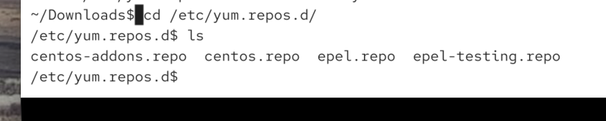
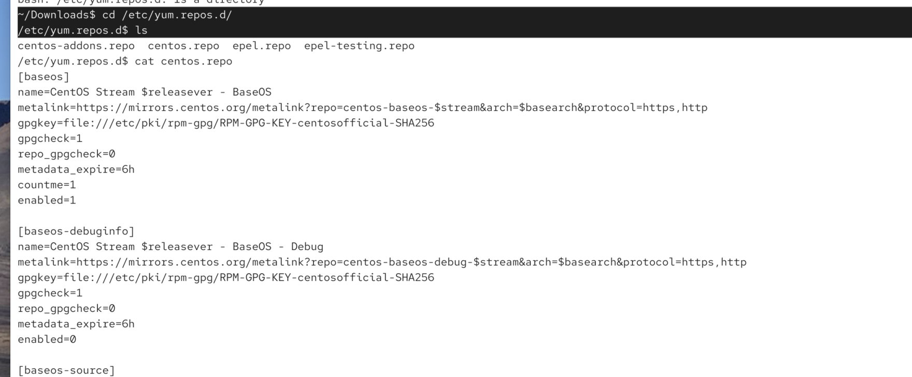
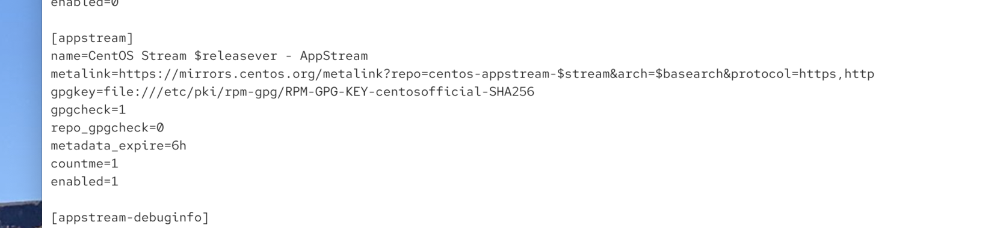

for ex. we want to install a tool `dnf install gimp`

how does dnf know where to download the softawre from?

tjis is what repositores are for: we can define those repos in the following files:

usually its here:
/etc/yum.repos.d/*.repo

but also can be in :
/etc/dnf/dnf.conf

for ex. for crb source  we have name and extra info

metalink has the link from where it will be downloaded.

enabled=1 and not enabled repositores

full system of RHEL needs at least BaseOS and AppStream

we have it:

`cd /etc/yum/repos/d` we can read redhat.repo and we

we dont need to refresh this index manually. dnf will automatically refresh and download the latest package. we always work with latest package index htat is available. /etc/yum.repos.d/*.repo

if we want to install the program for ex `sudo dnf install neofetch`

often many other programs are installed together due to dependancies. we also got "weak dependancies"