# what is a shell

shell = outer layer of operating system

it takes commands from the user and translates them into a form tha tthe kernel can understand

it can  also display things to the terminal


CLI = tex based interface that allows users to interact with systems by typing commands

often shell refers to cli

linux shell = text base interfaces, that allows us to work on devices that dont support a gui

so we usually mean terminal is a shell

# Environment variables

used to store config info and settings

they influence the shell and program behaviour

convention: env variables are written in uppercase letters

env variables vs bash variables (not written in uppercase)

list env variables

`env`:

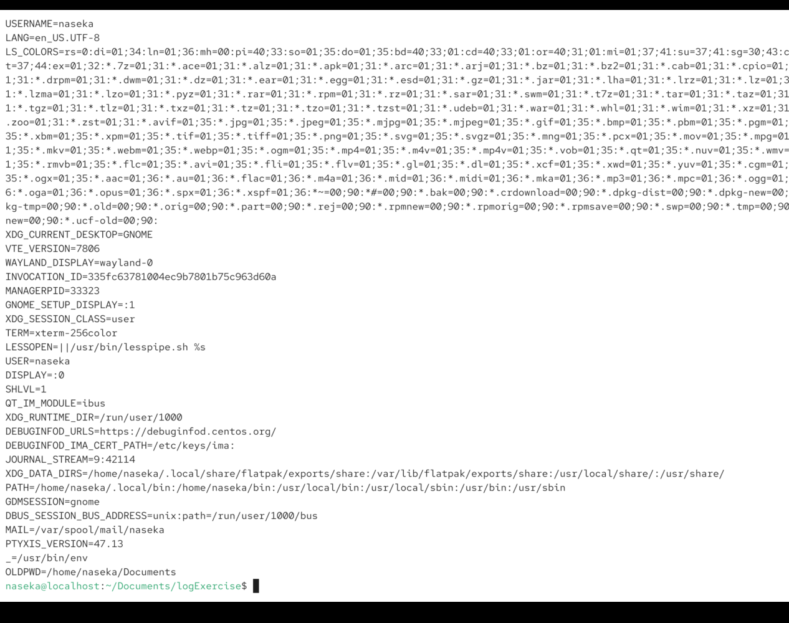

`echo "${PWD}"`

$ means to access the variable

we put doublequotes 

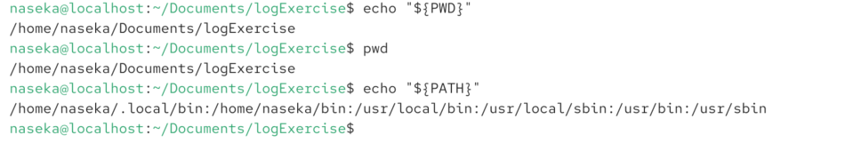

better with curly braces, to make sure to see whats exactly variable is:

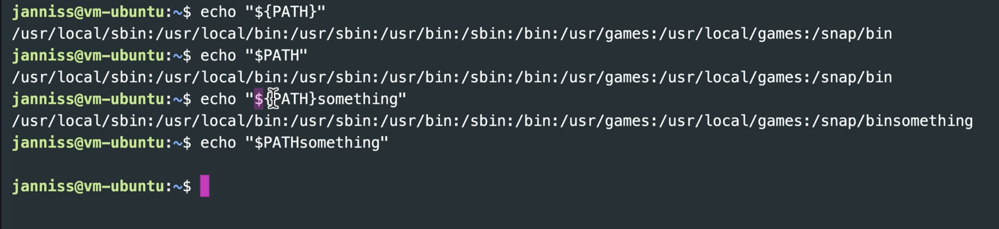


# HOME variable

stores the current user's home directory path
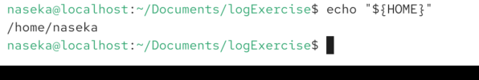

# PWD

# OLDPWD (old working directory)

# USER
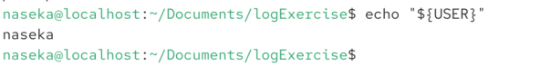

# set env variables

`export VAR=value`

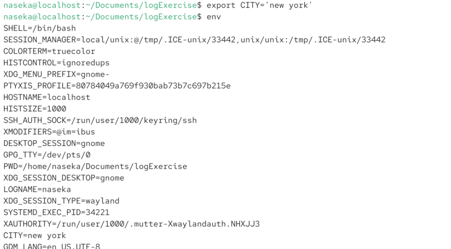

# rewrite the variable

`variablename='new value'`

important!! no spaces around =

whitespace matters in bash

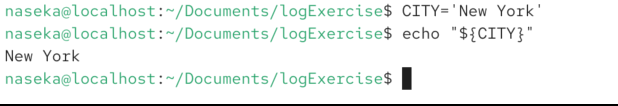

# Delete env variable

`unset VAR`

for ex. i created city variable 


and then removed it:


# PATH variable

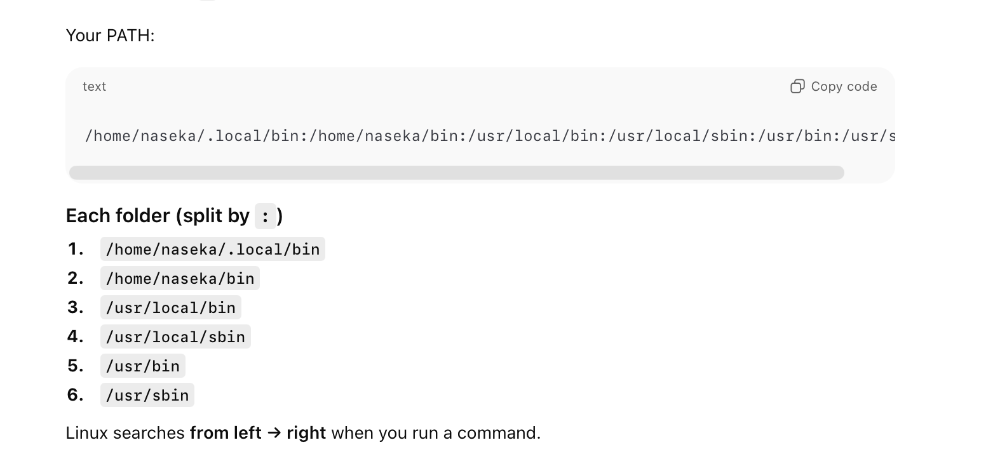

```bash
naseka@localhost:~/Documents$ echo "${PATH}"
/home/naseka/.local/bin:/home/naseka/bin:/usr/local/bin:/usr/local/sbin:/usr/bin:/usr/sbin
```
since cat command is in /home/naseka/bin -> we could do this:

```bash
naseka@localhost:~/Documents$ /bin/cat ping.txt
ping: testaeteaq.com: Name or service not known
naseka@localhost:~/Documents$ 
```

# Why we need different paths?
Filesystem Hierarchy Standard: standard where to place files
single User mode: a special way to launch linux for repairing a broken system - we need to access essential tools

* /bin: essentials binaries, that need to be always available

* /sbin: essential binaries, that are usually executed as root, and need to be always available

* /usr/bin: non-essential binaries for all users.

* /usr/sbin: non-essential binaries, ussually exectures as root. Could be shared with other computers

* /user/local/bin: non es, everyone, specific to this host

* /user/local/sbin: non es, root, specific to this host

both are same:

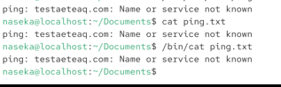


Path might be different on different systems. On my MAC:

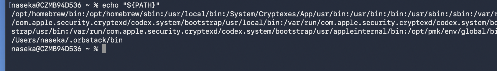

all folders are checked from left to the right to check for executables

# Modifying the PATH variable

for ex.: /opt/homebrew/bin : in this folder there is a lot for mac
for ex.: we have separate directory in which we want to install special executables files on our system

## to append the directory to our PATH:

PATH="${PATH}:/new/path"

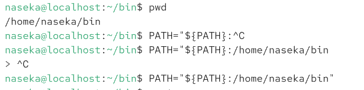

1) first we created a directory bin 
2) we added this directory to the Path
3) we then inside bin we created a custom program
4) since the program is in the path (cause new bin is in the path) -> we can execute the custom program from anywhere 

```bash
naseka@localhost:~$ mkdir bin
naseka@localhost:~$ cd bin/
naseka@localhost:~/bin$ pwd
/home/naseka/bin
naseka@localhost:~/bin$ PATH="${PATH}:/home/naseka/bin"
naseka@localhost:~/bin$ custom_program
bash: custom_program: command not found...
naseka@localhost:~/bin$ touch custom_program
naseka@localhost:~/bin$ chmod +x custom_program # make the program executable
naseka@localhost:~/bin$ custom_program
naseka@localhost:~/bin$ cd /
naseka@localhost:/$ custom_program
naseka@localhost:/$ 
```

# Troubleshooting PATH issues

1) "command not found"
    verify the contents of the var PATH
    the order of entry should be correct
    the desired directory should be included

`which` command:

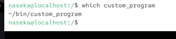

every time we restart terminal -> path variable gets  reset. so its not enough.. later on ore

Best practices: 

* keep system directories at the beginning
* avoid unnecessary duplication of directories
* minimize the number of directoreis to improve search efficiency
* regularly review and clean up the path
* be cauthious modifything path for system wide changes


# adding python script

```bash
naseka@localhost:~/bin$ cd /home/naseka/bin
naseka@localhost:~/bin$ ls
custom_program
naseka@localhost:~/bin$ touch hello_world
naseka@localhost:~/bin$ chmod +x hello_world
naseka@localhost:~/bin$ ls
custom_program  hello_world
naseka@localhost:~/bin$ echo "${PATH}"
/home/naseka/.local/bin:/home/naseka/bin:/usr/local/bin:/usr/local/sbin:/usr/bin:/usr/sbin:/home/naseka/bin
naseka@localhost:~/bin$ ls
custom_program  hello_world
naseka@localhost:~/bin$ nano hello_world
naseka@localhost:~/bin$ cat hello_world
print("Hello world from Python")
naseka@localhost:~/bin$ python3 hello_world
Hello world from Python
naseka@localhost:~/bin$ 
```

now i need to make sure we can execute the file wihtout python command

so we need to specify how this program should be executed

this means python 3 will be launhced. must be first line!

This line is called *shebang* and it tells OC which interprpeter to use to run the script:

`#!/usr/bin/env python3`

/usr/bin/env -> its location of env program

env program fins a command python3 anywhere in the PATH and then run it:


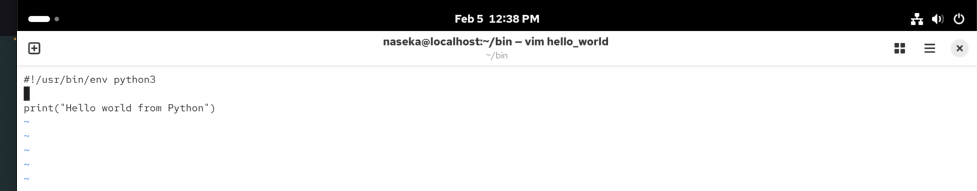

then we can execute the command:

```bash
naseka@localhost:~/bin$ python3 hello_world
Hello world from Python
naseka@localhost:~/bin$ vim hello_world
naseka@localhost:~/bin$ cat hello_world
#!/usr/bin/env python3

print("Hello world from Python")
naseka@localhost:~/bin$ hello_world
Hello world from Python
naseka@localhost:~/bin$ pwd
/home/naseka/bin
naseka@localhost:~/bin$ /home/naseka/bin/hello_world
Hello world from Python
naseka@localhost:~/bin$ 
```

# Utilizing Env Var for Data Transfer into Programs

env var are not BASH

`export` means we dont want it to be managed by bash, but we want for this process to use the environment variable, so we are "exporting"

env variables are automatically available for all programs that we launch

env var are often used to pass configuration data to programs

here we created a variable LOGIN_CONFIG -> then we created a file env.py => inside of that file we wrote python script -> then we ran this python script and we could see all our env variables including new one:

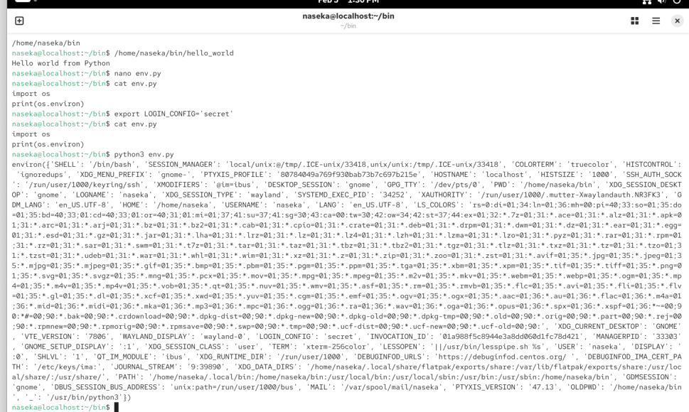

every time we start a program, we create a copy of our environment

```bash
naseka@localhost:~/bin$ vim env.py
naseka@localhost:~/bin$ cat env.py
import os
print(os.environ['LOGIN_CONFIG'])
naseka@localhost:~/bin$ python3 env.py
secret
naseka@localhost:~/bin$ 
```

then we change the variable to new secret:
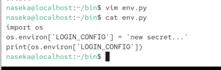


we can see it got changed for python variable:

```bash
naseka@localhost:~/bin$ python3 env.py
new secret...
naseka@localhost:~/bin$ 
```

but didnt change for the rest:

```bash
naseka@localhost:~/bin$ echo "${LOGIN_CONFIG}"
secret
naseka@localhost:~/bin$ 
```

thats how we comment out the lines in python:

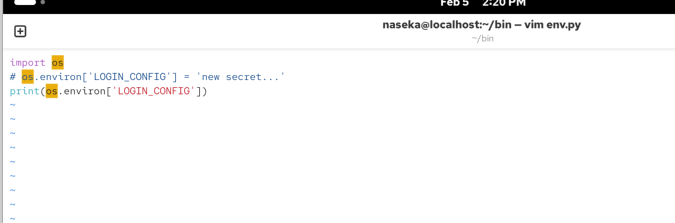

sometimes we want env varibale for single comand:

means that variables is changed to. localhost:3306 ONLY for the python3 program "env.py"


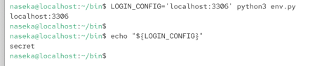

for ex. if we run locally -> one value. if we connect to cloud -> we use different value.


# Env variable SHELL

stores the path to the user's DEFAULT shell (not current shell)

inherited as a normal environment variable

in my vm (centos):

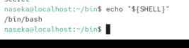

in my mac:

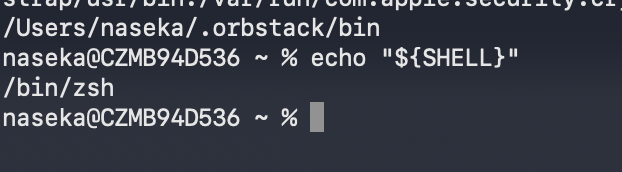

command to change default shell:

`chsh -s "/bin/bash"` -> it must be a shell that is listed in the file /etc/shells. it should then take effect after the next login.


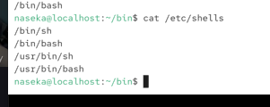

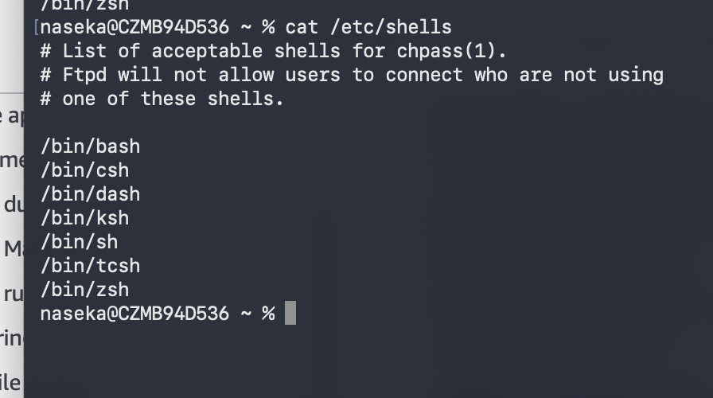

# Storing custom shell configurations

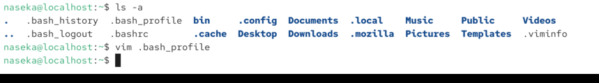

bash can start in various ways: ssh or computer

tty3 -> then there is a real login shell

ctrl + alt + F2 or F3

terminal is not real shell


# A login shell 

is a shell that starts after you log into the system.

Examples:

* logging in via SSH
* logging in on a text console (TTY)

In a login shell:
* the system treats you as a new logged-in user
* special startup files are read

Linux has multiple virtual terminals called TTYs.

## What does TTY mean?
TTY = Teletype

Historically:
* Early computers used teletype machines (typewriter + printer)
* Users typed commands, computer printed text back
* The name TTY stuck

## What is tty1, tty2, tty3…?
Linux provides multiple virtual terminals (virtual TTYs).

Think of them as:
* multiple independent “screens” you can log into at the same time.

Typical setup:
* tty1 → often reserved for system / GUI
* tty2–tty6 → text login terminals

Each TTY:
* is a separate login session
* can run a different user
* has its own shell and processes

## Why do multiple TTYs exist?
Because Linux is designed as a multi-user, multi-session system.

Real examples:
* One TTY running a broken program
* Another TTY to fix it
* One user logged in on tty2
* Another on tty3

All at once

# how to login to real interactive login shell

when i see two usernames while launching centos vm -> i need to press 

`ctrl + option + fn + F2` -> tty2

`ctrl + option + fn + F3` -> tty3

etc

theni i see login prompt:
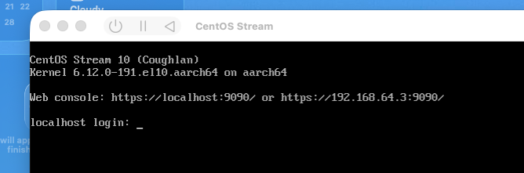

type username and then password:

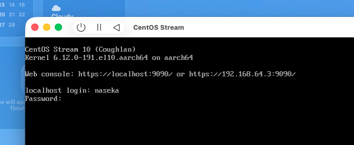

press enter:

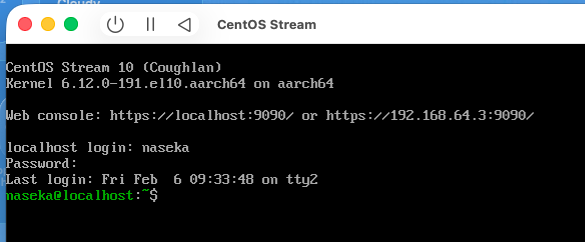


# startup files

there are different startup files dependign on configuration:

.bash_profile
.bashrc
.profile
.bash_login
etc

cause bash starts via different modes, thats why we have many startup files

bash is NOT login shell. only tty is a login shell (CTRL + OPTION + FN + F1) -> this will open tty1

switch back to gui from any tty: `ctrl+option+FN+F1`

it is login shell, cuase it asked us to login

# shells

* interactive NON login shell: we run bash within an existing terminal

* non-interactive non login: we run a .sh-script

* non-interactive login shell: for ex. 

```bash
echo 'commmand'|ssh server # non interactive: we are feeding command into ssh, instead of typing by hand. normally ssh starts an interactive shell (you type commands), but here ssh receives input from a pipe. login: ssh always starts a login shell on the remote host, so the shell is login shell
```


# Bash startup files

* Interactive login shell:
    * `/etc/profile` #system wide configuration, applies to all users.
    * Bash checks in this order and stops at the first one it finds (only one is executed, not all 3):
        1) ~/.bash_profile
        2) ~/.bash_login
        3) ~/.profile

        in my case `/etc/profile` has the following content:

        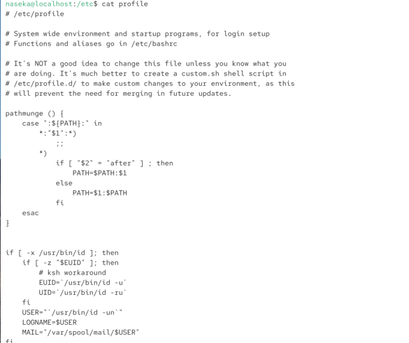


* Interactive non login shell (our user is already logged in, system is up and running). its the one i open my terminal for ex. some stuff already done in gui (like loggin us in)
    * ~/.bashrc

* Non-interactive shells (login * non-login):

**Non-interactive shell** is Bash running without human typing commands, usually for scripts - and Bash only reads one special file if you tell it to.

when a script runs:
```bash
./myscript/sh # we are running a file sh inside a folder myscript
```

examples: 
1) Jenkins runs a shell step
2) cron runs something
3) a program runs Bash in the background

In all these 3 cases:
 -> no prompt, no typing, no .bashrc (interactive non login), no .bash_profile (interactive login) by defailt

## the key idea: bash's internal question
When Bash is started to run a script, it behaves like this:

        I am running a script.
        There is no user.
        There is no terminal.
        Do i need to load any environment?


Default answer: No -> UNLSESS YOU EXPLICITLY TELL IT

Explicitly we tell bash "before running this script, load this environment file":

```bash
BASH_ENV=/some/file
```

so -> BASH_ENV is an environment variable. if it exists, then bash does this before running the script:

`Read and execute /some/file`

! Bash does not do PATH search for the file, so you must use the explicit full location of the file to run. for ex:

```bash
BASH_ENV=/full/path/to/myenv.sh
```

* Bash loooks for and environment variable BASH_ENV
* If found, will try to execute this file (without looking in PATH)

