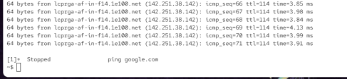
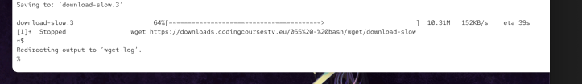

# Sighup

sighup signal is used to communite that terminal has closed

the program then usually exist

signal can be ignored

# sigstop

tells the proces that we want to put the process to stopped (paused) state

`/proc/35251$ kill -s SIGSTOP 287187`

# SIGCONT

SIGCONT will resume the state

after SIGSTOP on for some time the connection to remote server will be closed. 

