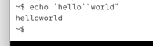
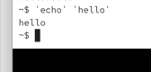
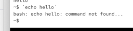

`cat $PWD/*.txt`: no qiotes -> all available shell expansions are being applied

single quotes: all expansions are disabled, word splitting is disabled:

`echo '$PWD/*.txt'`

Double quots: most expansions are disabled. variable explansion worked, but file expansion not worked:

quotes in bash: only define how bash will expand/split the command, they do nothing else!

or this: `'echo' 'hello world'`

here we disabled word splitting:

