# > 

outputng the result of a command to the file, but overwriting:

`ls > out.txt`: “Take stdout (1) and send it to out.txt instead of the terminal.” -> errors still go to terminal

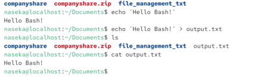

but we can see that output gets overwritten every time with >

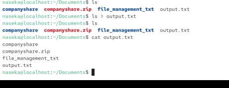

# >> 

appended to the file, no overwriting, errors still go to terminal

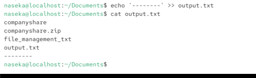

# error output

some of the output is not wrtitten: errors. the error is not appended. 

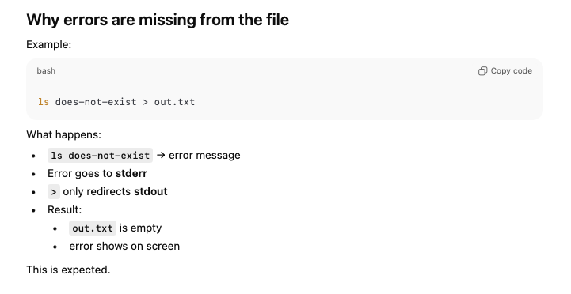


# standared streams:

3 communication channels:

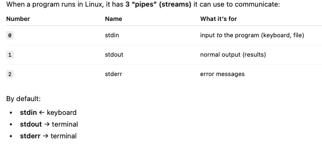


## stdin
standart input (from the keyboard)

## stdout (stream 1)
program wants to display on our screen

by using > and >> we are rediricting stdout to a file


## stderr (stream 2)
by default errors get printed to the screen

> and >> they dont redirect errors to a file

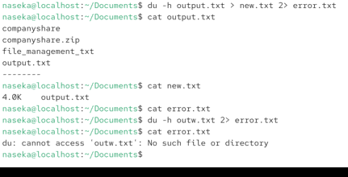

# /dev/null

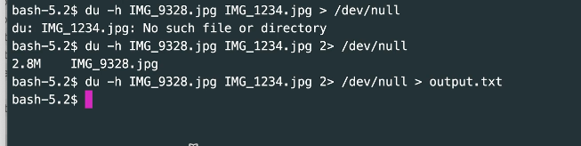

        /dev/null je speciální virtuální soubor v Linuxu/Unixu, kterému se často říká “černá díra”.
        Co přesně dělá
        Všechno, co do něj zapíšeš → nenávratně zmizí
        Když z něj čteš → vrátí okamžitě EOF (nic)
        Je to zařízení, ne skutečný soubor na disku.
        Proč existuje (praktický smysl)
        Slouží hlavně k:
        potlačení výstupu programů
        zahazování chybových hlášek
        testování, skriptování, cronů

# redirect both stderr and stdout to the same file 
we could do this:

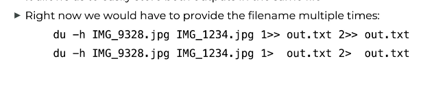

we can combine commands with pipes

&1

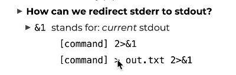

```bash
[command] > out.txt 2>&1 #first we say redirect regular output to out.txt and second we want stderr to be redirected to the same file where stdout (1) is going.
```

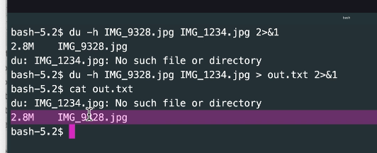

on the sreenshot first we said that we also want to putput to terminal the error

# order of redirects is important

## correct order:
 ```bash
 command > out.txt 2>&1
 ```

Timeline:

1) stdout -> out.txt
2) stderr goes to the same place as stdout, meaning to the file out.txt

## wrong order:
```bash
command 2>&1 > out.txt
```

Timeline:
1) stderr goes to the same place as stdout, for now stdout goes to terminal, so stderr goes to terminal too
2) stdout goes to out.txt

# stdin

0 = stdin
1 = stdout
2 = stderr

redirect a file into stdin


1) i put wc -l
2) i type (standard input)
3) ctrl D 

ctrl D -> it will quit the standard input:


cat also accepts stardard input.
first line what we typed and second line is output.

## <

wc -l < out.txt

out.txt -> this is the standard input taken to our teminal

here we say: use out.txt as an input of cat (- parameter) and then send stdout into another.txt = its equvalent to copy `cp out.txt another.txt`

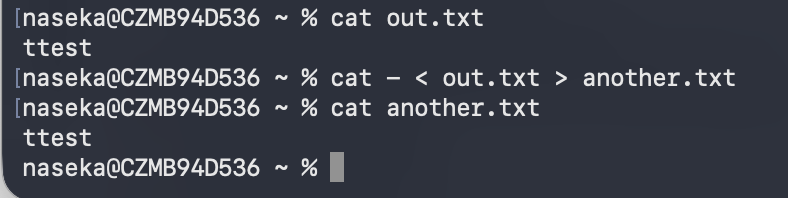

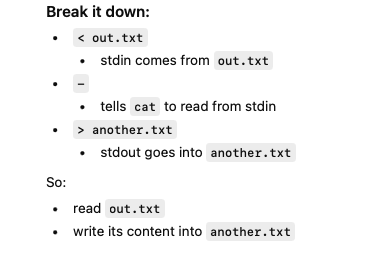


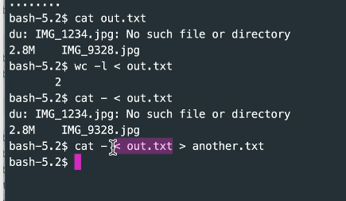

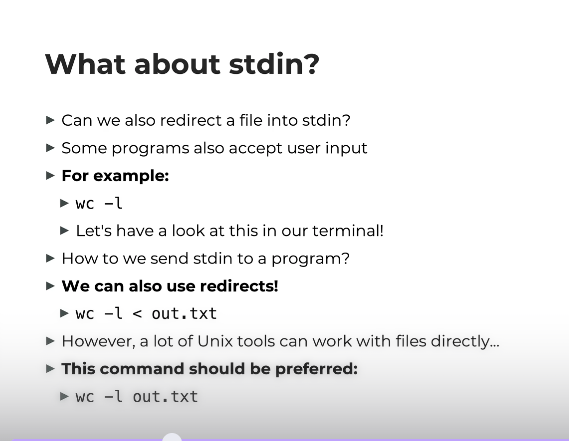

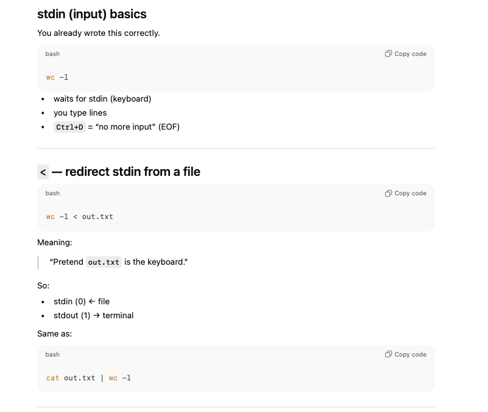

