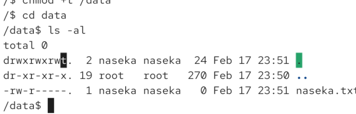

extra bit that we can set for all files or directories

for files: obsolete, no longer used

for directories: without sticky bit any user with write + execute can rename and delete files in them

the user cannot read directory, but he is allwoed to rename or remove

if sticky bit is iset only the owner and root of a file or the directory owner can rename or delete a file. but if another user created a file, me as an owner of directory, i still can delete the file.

# tmp folder

there we have folder for temporary data, but we dont want other users to delete temp files. so only if i created teh file, only me should be able to delete or rename it

# how to set it

`chmod +t [folder]`
`/$ chmod +t /data` -> if anothe user tries to rename or remove he cannot do it

but if directory owner is there he can still delete it.

? or in octal notation: 
set sickty bitL
unset sticky bit:

# hot to inspect
lower case is t if its executable or T if its not executable

here it means others can read write and execute but they cannot remove rename due to sticky bit

