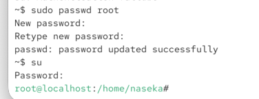

`su` swiwtch user

then we can login as a different user. we need a pwd

`~$ su lauren`

exit -> i am back to my user

su can be used to switch to root, then i would need the pwd of root user

first give pwd to root user and then su to that user:

# to delete pwd

`sudo passwd -d root`

with -l we can also lock password `sudo passwd -d -l root`

then root will have ! instead of password. so no password and possibility to login as a root

