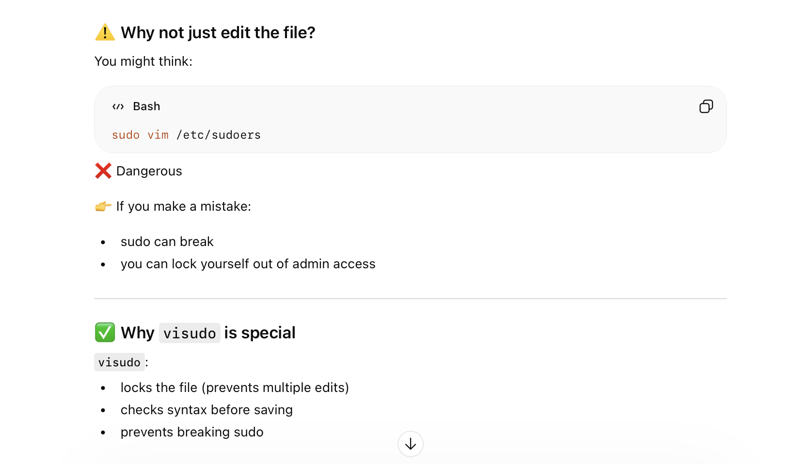
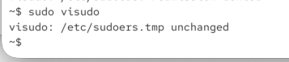
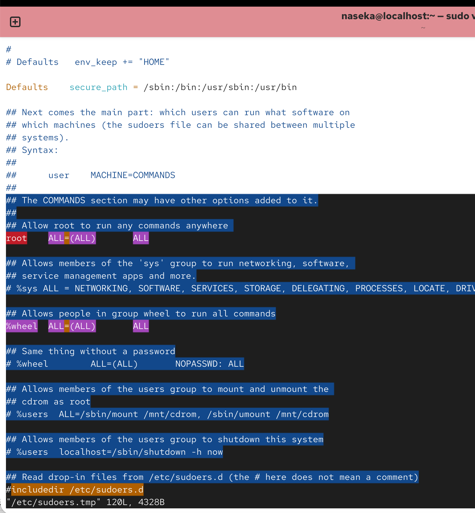
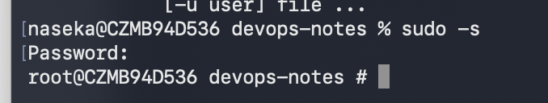

sudo = superuser do

temporarily gives priveleges of another user - by default from the root user


sudoers are configured here - we specify users who can use sudo

/etc/sudoers

we can open the file

when i read the file, that i need to use visudo command instead of vim, cause its safer:



it creates temp file:



those are contents of sudoers file, when typing sudo visudo




## sudoers lines explained

```nginx
USER_or_GROUP  HOST=(RUN_AS_USER)  COMMANDS
```
“This user/group on this host may run these commands as this user.”

example below says: root user can run commands as any user on any machine and can run any commands

```sql
root    ALL=(ALL)       ALL
```
sudo -k -> it will expire the sudo session and i need to put password again for sudo

sudo -s -> it will start a shell with eleveated rughts




