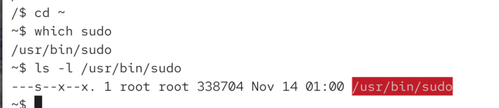
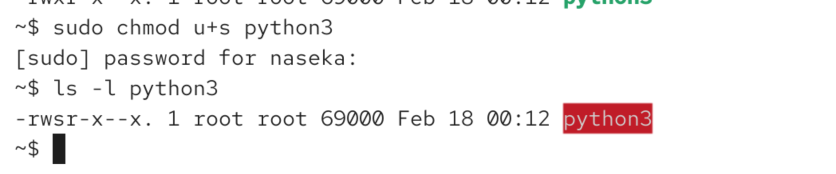
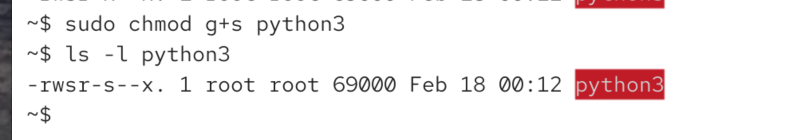

# question

how certain programs have additional privileges? 

ex: sudo, su, mount

SUID = Set User ID

* we can set a special bit for executable files, if it is set the executable witll gain the rights of the owner. this allows unprivileged users to access privileged resources
* be carefule: security issue if used improperly
* on most systems, the SUID bit is limited to executable binary files
* its usually not supported for executable scripts (.sh, .py)
* if we set it on our own programs, we can easily create major security vulnerabilities. 

# how to inspect SUID bit

`ls -l`

example: -rwsrwxrwx 
lower case s means SSUID bit + execute bit
upper case S means... no execute bit

we can see root user owns it. we can see sudo can execute

# how to manualy set it

`chmod u+s file` it will only take effect if its executable file

!!! we should also limit write access to this file as much as possible! 

# SGID

we can give additional privileges basedon the group

ls -l file
-rwxrwsrwx -> works same as for the SUID

