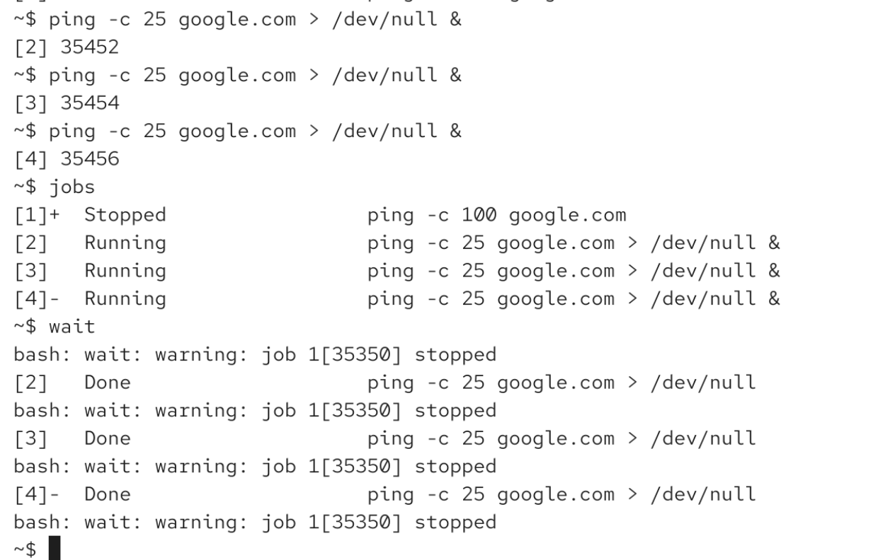
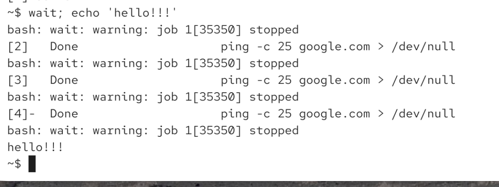
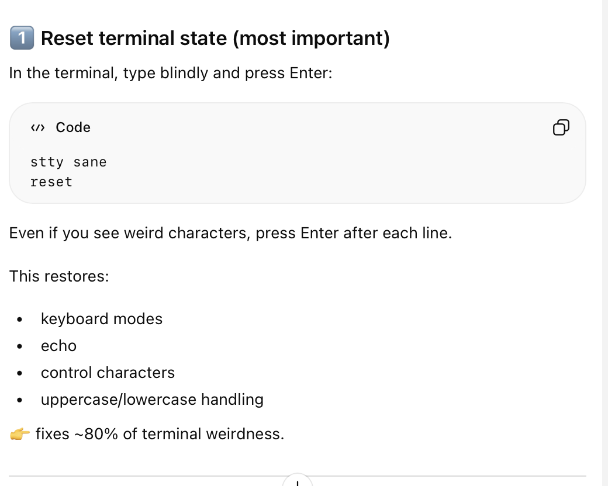
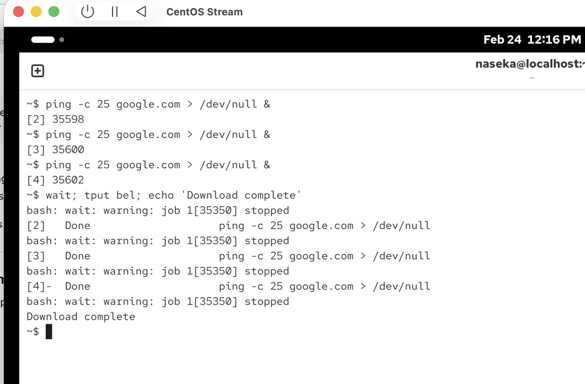

we have 3 downlaods and all they are running in bg

with the wait commmand we can wait  untill all currently running jobs have changed their state

wait 123 -> waits for process with ID123

wait %1 -> waits for jon with id 1

wait -n -> any jon to be completed

wait will be ran in foreground and it waits once finsihed all 3 jobas are done:

here we executed one after another:

here we will print only after all 3 jobs are done:

tput: its just characters which are send to our terminal

if terminal behaves weird:

# now as soon as all 3 jobs finished -> there will be a sound and pringing Download complete:

