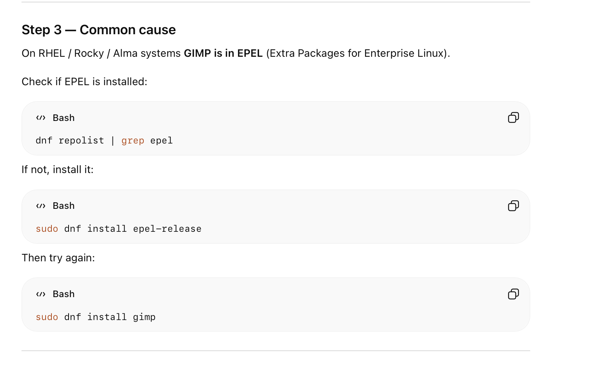

it will allow us to create "smaller version" of centos. so we can just install tools we need without "weak dependacies" for ex. to save storage. or to debug if anything goes wrong

 depancies:
* required depenacies = essential for OS. without them we cannot execute the program
* weak dependances = optional. they enhance the functionality
    * recomends = package recommends another package. most users want to install this other package
    * suggests = this package can use another pacakte but usually we wouldnt need this other package.

by deafult dnf will install recommended weak dependancies as well (if it doesnt trigger a conflict)

how we can list the weak dependacies:
 `dnf repoquery --recommends [package_name]`

 `dnf repoquery --suggests [package_name]` (mostly for informational purposes)


to disable weak dependacies: in /etc/dnf/dnf.conf there is a paramater install_weak_deps=False

dnf isntall [] --setopt=install_weak_deps=False


i got no match trying to install gimp:

```bash
dnf install: error: unrecognized arguments: --sentopt=install_weak_deps=False
/etc/yum.repos.d$ sudo dnf install gimp --setopt=install_weak_deps=False
Last metadata expiration check: 2:06:19 ago on Wed 04 Mar 2026 11:42:43 AM CET.
No match for argument: gimp
Error: Unable to find a match: gimp
/etc/yum.repos.d$ c
```



```bash
/etc/yum.repos.d$ dnf repolist | grep epel
epel                   Extra Packages for Enterprise Linux 10 - aarch64
/etc/yum.repos.d$ 
```

finished at 06:23
